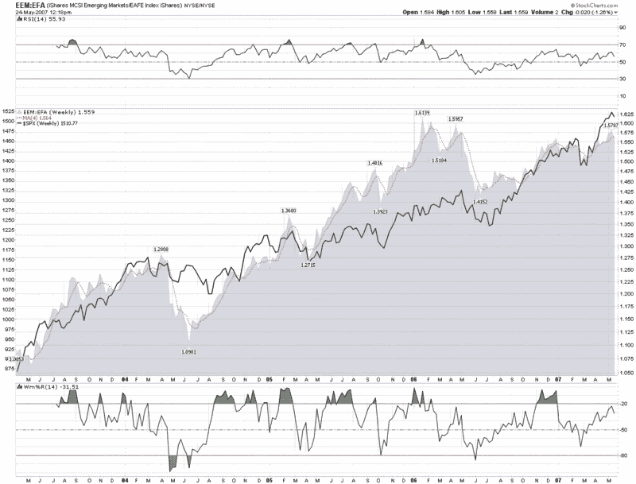

<!--yml

分类：未分类

日期：2024-05-18 19:13:29

-->

# VIX 和更多：一个值得关注的全球指标

> 来源：[`vixandmore.blogspot.com/2007/05/global-indicator-to-watch.html#0001-01-01`](http://vixandmore.blogspot.com/2007/05/global-indicator-to-watch.html#0001-01-01)

的一个最佳特性是，它允许你跟踪几乎任何你能想到的比率。随着 ETF 影响力的持续扩大（由 Tom Lydon 在等人监控），可能性正在迅速增长，受限于新发行的 ETF 的历史数据缺乏，而不是其他任何东西。

随着关于中国泡沫的谈论，现在是拥有一个或多个良好的全球情绪指标的最佳时机，这样你就可以了解是否应该担心[墨西哥](http://finance.google.com/finance?q=eww&hl=en)、[马来西亚](http://finance.google.com/finance?q=ewm&hl=en)、[巴西](http://finance.google.com/finance?q=ewz&hl=en)和可能[中国](http://finance.google.com/finance?q=fxi&hl=en)的投机活动的程度，或者你是否可能更好地跟随趋势。

我一直关注的比率之一是新兴市场与发展市场之间的比率。跟踪这些市场非常好 two highly liquid ETFs are the  and the , where EAFE refers to Europe, Australasia and the <place st="on">Far East</place>. Each ETF is capitalization-weighted and you can get a sense of the differences in their holdings by looking at the  complete holdings list for  and .

自从 EEM 在 2003 年 4 月首次交易，而 EFA 回溯到 2001 年 8 月以来，我们的比率图能够提供四年的组合数据，这在 ETF 年份中是相当长的时间。

在下面的图表中，新兴市场的相对峰值通常提供了投机活动是否失控的指示，通常为即将到来的 SPX 下跌提供预警。我将留给读者判断这种相关性是否值得跟踪。我肯定会保持关注。

