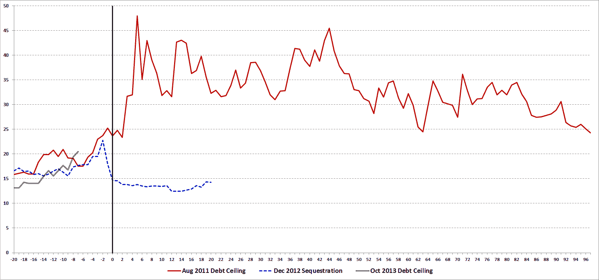

<!--yml

分类：未分类

日期：2024-05-18 16:13:03

-->

# VIX 和更多：近年来债务上限和自动减支斗争的 VIX 历史

> 来源：[`vixandmore.blogspot.com/2013/10/a-history-of-vix-during-recent-debt.html#0001-01-01`](http://vixandmore.blogspot.com/2013/10/a-history-of-vix-during-recent-debt.html#0001-01-01)

自从我们出生之前，民主党和共和党就在预算和相关事务上争吵不休，虽然有时辩论激烈，但最近才导致美国债务信用受到质疑。

例如，在导致 1995 年 11 月 14 日至 19 日政府关闭和 1995 年 12 月 16 日至 1996 年 1 月 6 日政府关闭的僵局期间，空气中没有一丝恐慌的气息，因为 VIX 从未超过 15，在关闭期间有很大一部分时间都在 10 年代。

最近三次政党预算争吵的情况与克林顿时代的预算斗争大不相同，而且只需观察这些斗争期间 VIX 的轨迹，就能感受到这段时间内 SPX 期权中所蕴含的不确定性、焦虑和风险。当然，这些预算和债务上限斗争并没有在真空中进行，2011 年 8 月的债务上限斗争是在[希腊](http://vixandmore.blogspot.com/search/label/Greece)和[欧元区主权债务](http://vixandmore.blogspot.com/search/label/European%20sovereign%20debt%20crisis)局势急剧恶化的情况下进行的，但这三个危机期间 VIX 的相对变动仍然具有启发性。

下面的图表捕捉了在以下三次预算斗争之前的月份以及随后的数据，所有这些都有特定的截止日期，这些日期在图表中由穿过零日的垂直黑色线条标识：

+   2011 年 8 月的债务上限危机

+   2012 年 12 月的自动减支危机([财政悬崖](http://vixandmore.blogspot.com/search/label/fiscal%20cliff))

+   当前的债务上限危机

注意，2011 年 8 月的债务上限危机是一个经典例子，表明风险最终变得比几乎所有人的预测都要大得多，而与 2012 年 12 月的自动减支危机相关的担忧很快消失了。历史上，误报的次数远远多于失去控制的危机，这是投资者倾向于低估和/或打折每个威胁的全面潜力以及为什么[VIX 倾向于急剧波动](http://vixandmore.blogspot.com/search/label/VIX%20spikes)然后[迅速均值回归](http://vixandmore.blogspot.com/search/label/mean%20reversion)的部分原因。

在 10 月 17 日债务上限截止日期到来前的一个多星期，VIX 现在的水位比 2011 年 7 月或 2012 年 12 月相似阶段的水平要高。当然，自从上两次预算战斗以来，政治格局已经发生了变化，民主党和共和党都有机会在这段时间内完善他们的策略和战术。这一切在本周和下周如何展开，无人能预测。我仍然很难相信会出现违约，但这仍然留有足够的空间出现一种“解决方案”——这种方案会延长当前的焦虑并导致更多的激烈战斗——其中一些可能会更加代价高昂——在未来发生。

所以，尽一切办法希望重演 2012 年 12 月的情况，但以防万一，还是为 2011 年 8 月做好准备吧...

[来源(s): CBOE, VIX and More]

相关帖子：

**披露(s):** *无*
