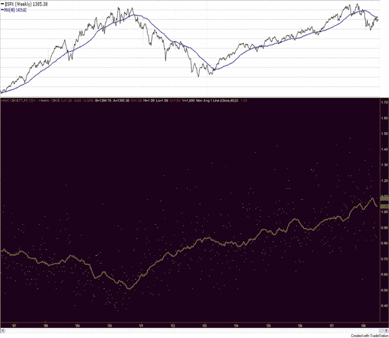

<!--yml

类别：未分类

日期：2024-05-18 18:34:47

-->

# VIX 和更多内容：看涨期权与看跌期权比率的长远视角

> 来源：[`vixandmore.blogspot.com/2008/06/long-term-view-of-put-to-call-ratio.html#0001-01-01`](http://vixandmore.blogspot.com/2008/06/long-term-view-of-put-to-call-ratio.html#0001-01-01)

在 2008 年出现的所有交易/投资博客中，我认为我最喜欢的是 Rob Hanna 的[Quantifiable Edges](http://quantifiableedges.blogspot.com/)。标题几乎概括了博客的方法。这是一个 Rob 分析市场，观察大多数投资者下面隐藏的各种关系的地方，提取一些洞察力，并回测这些想法，以确定它们的历史盈利潜力。

今天 Rob 采取了稍微不同的方法，因为凯尔特人-湖人比赛似乎耗尽了他的夜间研发团队。相反，在[为什么你需要标准化看涨期权与看跌期权比率](http://quantifiableedges.blogspot.com/2008/06/why-you-need-to-normalize-putcall-ratio.html)中，Rob 发布了一张看起来很像夜空的图表（下面第一张图表的底部部分），但实际上包含了 12 年的[CBOE 总看涨期权与看跌期权比率](http://vixandmore.blogspot.com/search/label/%24CPC)。

Rob 的结论与我的许多想法相似，值得详细记录：

经常听到交易者将看涨期权/看跌期权比率的绝对水平视为有意义。从上面的图表中可以看到，“有意义”的时间随时间而变化。从’97 到’02 期间，比率超过 1.00 的“尖峰”可能被视为有意义。看到这样的读数的交易者可能会得出结论，期权交易者的恐惧情绪很高。现在，1.00 的读数低于平均水平。0.5 的读数肯定会很有意义，尽管如此。2000 年，它大约是平均水平。7 或 8 年前可能已经开发出了寻找特定数字的策略，现在这些策略可能已经过时了。但这并不意味着看涨期权/看跌期权比率已经停止作为指标发挥作用。

问题在于交易者和机构对期权的流行和使用随时间而变化。它将继续变化。为了调整这一点，你应该对某个时间段内的读数进行标准化，然后将当前读数与“正常”进行比较。”*

只是为了好玩，我在 Rob 的看涨期权与看跌期权比率的 TradeStation 图表顶部附上了 StockCharts.com 的 SPX 图表。它可能看起来像某种视觉上的米诺陶洛斯，但结果显示了从 1995 年中到 2003 年底看涨期权与看跌期权比率和 SPX 之间的几乎完美的负相关性。然后，在 2004 年到 2008 年之间，相关性突然从负数变为正数，在过去的六个月左右又恢复到传统的负相关模式。

在下面的图表中，我已经尽力将总看跌/看涨比率周图表放入一个绝对刻度，以提供有意义的买入和卖出信号。有多种方式可以解读这个图表。首先，需要承认图表中没有在相同的时间范围内生成有意义买入和卖出信号的地方。第二个可能的结论是，当 P/C 水平低于红色卖出线或高于绿色买入线较长时间时，这可能是一个信号（回想起来，这是一个有帮助的信号）在 1999-2001 年做空，在 2005-2008 年做多。最后，虽然图表中没有明确说明，但可以看到跟踪显示的 6 周 EMA（用虚线蓝色表示）和长期（即 40-50 周）移动平均线（未显示）之间的偏差，可以提供衡量看跌/看涨比率绝对和相对水平的行动合成。

在观看凯尔特人和湖人比赛时，至少可以考虑这些...
