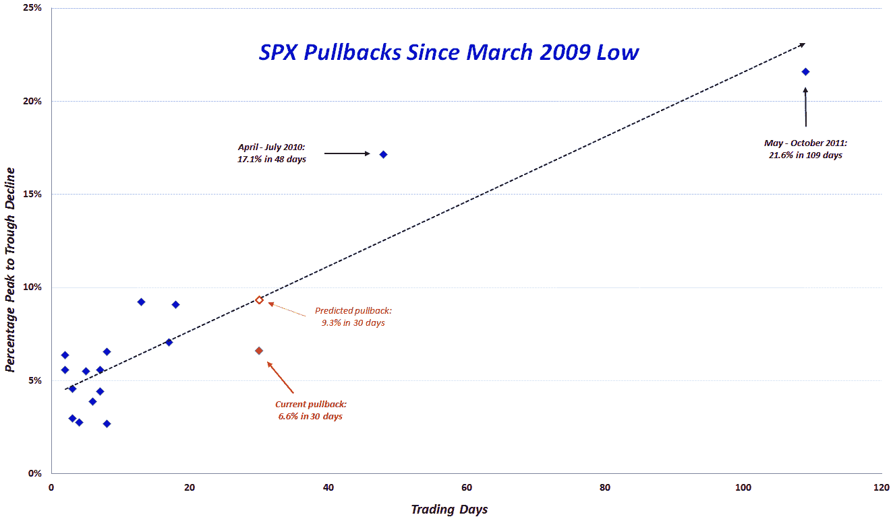

<!--yml

类别：未分类

日期：2024-05-18 16:30:22

-->

# VIX 和更多：2009-2012 年牛市回调的观察

> 来源：[`vixandmore.blogspot.com/2012/05/look-at-pullbacks-of-2009-2012-bull.html#0001-01-01`](http://vixandmore.blogspot.com/2012/05/look-at-pullbacks-of-2009-2012-bull.html#0001-01-01)

在过去三年中的不同时间，我发布了一个我称之为*VIX 和更多 2009-12 年标普 500 顶点到底部回调总结*的表格，最新版本可在 3 月的文章[将当前 2.6%的标普 500 回调放在近期历史背景中](http://vixandmore.blogspot.com/2012/03/putting-current-26-spx-pullback-in.html)中找到。

这次我想以一种更有价值的方式呈现相同的数据，该数据现在包括在 38 个月内进行的 17 次回调，以散点图的形式呈现，顶点到底部的跌幅幅度为 y 轴（反向）和从顶点到谷底的交易天数为 x 轴。

在下面的图表中，我用一个实心红色菱形标出了从 4 月 2 日的高点标普 500 指数 1422 点的 6.6%回调。这次回调现在在顶点到底部的幅度上排名第六深，在顶点到底部的交易天数上排名第三长。有趣的是，在 30 天内 6.6%的回调远低于（虚线黑色）整个数据集的线性趋势线；趋势线的 30 天预测实际上是 9.3%的回调，我用一个空心红色菱形标出。

为了参考，我还注明了过去 38 个月中最大的两个回调：

1.  2011 年 5 月至 10 月期间 109 天的 21.6%回调

1.  2010 年 4 月至 7 月期间 48 天的 17.1%回调

尽管上述两个回调都有多个原因，但在两个回调中都突出地出现了[希腊](http://vixandmore.blogspot.com/search/label/Greece)传染性恐慌的主题。

当前的市场回调是否会在标普 500 指数 1328 点止步还有待观察，但显然在任何人都会感到舒适地说[欧洲主权债务危机](http://vixandmore.blogspot.com/search/label/European%20sovereign%20debt%20crisis)得到控制之前还有很长的路要走。

相关文章：

数据来源：[雅虎]

**披露：** *无*
