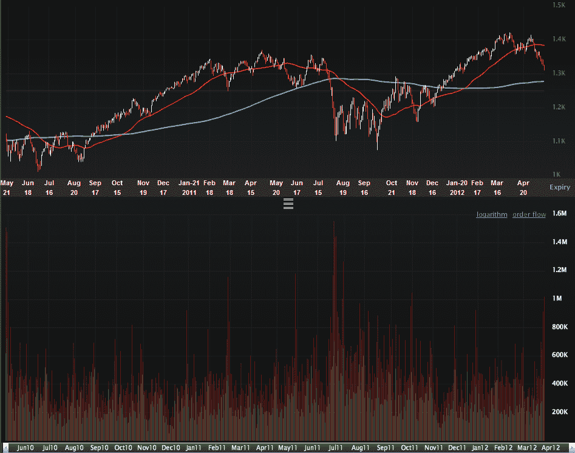

<!--yml

分类：未分类

日期：2024-05-18 16:30:00

›› -->

# VIX and More: A Million SPX Put Contracts Traded Today…a Contrarian Timing Signal

> 来源：[`vixandmore.blogspot.com/2012/05/million-spx-put-contracts-traded-todaya.html#0001-01-01`](http://vixandmore.blogspot.com/2012/05/million-spx-put-contracts-traded-todaya.html#0001-01-01)

在今天的交易时段还有一半小时结束时，已经有超过一百万份 SPX 看跌期权被交易，这大约是每日平均交易量的 2.5 倍。这种较高的看跌期权交易量是在昨天 913,000 份 SPX 看跌期权交易量的基础上，这是 2012 年的第二高交易量。

百万级别的 SPX 看跌期权是很少见的，通常这表明机构投资者进行了大量的对冲操作，同时也增加了投机活动。

观察下面的图表，该图表回溯了两年的时间，可以看到在那些看跌期权交易量（图表下半部分的垂直红色条形）达到一百万的罕见情况下，这通常与股票的底部相吻合。 *[编辑：今天最终的统计数字是 1.28 百万份 SPX 看跌期权，这是自 2011 年 8 月 9 日以来的最高总数]*

除了关注 SPX 的看跌期权，我还密切关注[ISEE](http://vixandmore.blogspot.com/search/label/ISEE)只关注股票的[看涨到看跌](http://vixandmore.blogspot.com/search/label/put%20to%20call)比率。我开发的一个基于 ISEE 的指标现在显示出自 2010 年 6 月底以来的最大逆市场情绪看涨倾向（由于看跌期权交易量的增加），就在 SPX 在 1010 点的关键底部出现前的两天。

当然，面对当前关于[希腊](http://vixandmore.blogspot.com/search/label/Greece)和[西班牙](http://vixandmore.blogspot.com/search/label/Spain)的担忧，历史并不保证会重复自己，甚至可能不会押韵，但现在看来，股票市场至少在不久的将来会找到一个短期底部。

相关文章：

*[来源(s): LivevolPro.com]*

***披露(s):*** *Livevol 是 VIX 和 More 的广告商*
