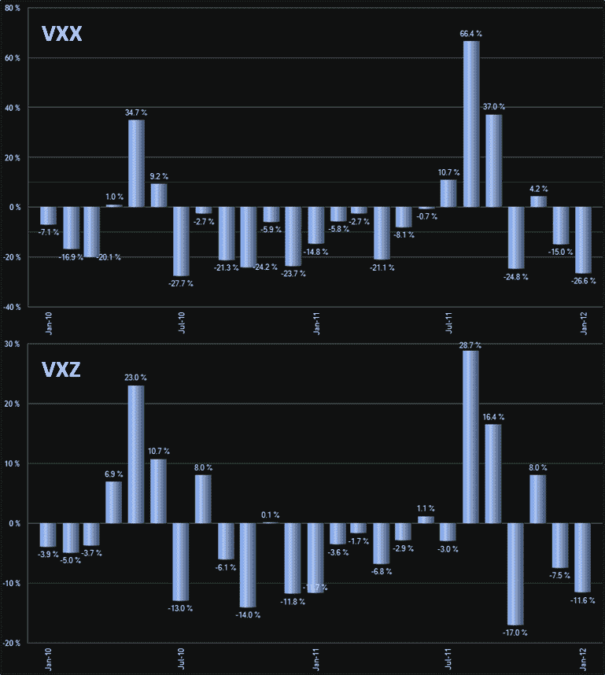

<!--yml

分类：未分类

日期：2024-05-18 16:42:04

-->

# VIX and More: VXX 与 VXZ 的月度比较

> 来源：[`vixandmore.blogspot.com/2012/01/monthly-comparison-of-vxx-and-vxz.html#0001-01-01`](http://vixandmore.blogspot.com/2012/01/monthly-comparison-of-vxx-and-vxz.html#0001-01-01)

[VXX](http://vixandmore.blogspot.com/search/label/VXX)在上市三年后，其资产管理规模是中期兄弟产品[VXZ](http://vixandmore.blogspot.com/search/label/VXZ)的大约四倍。在公关和媒体版面上，我想 VXX 的优势可能是 50 比 1。在许多方面，VXZ 是这对产品中的不受宠的孩子。

我最近评论说，在谈到这两款 ETP 的反向变种时，[ZIV 被不公正地忽视了](http://vixandmore.blogspot.com/2012/01/ziv-undeservedly-neglected.html)。我相信同样的情况也适用于 VXZ。VIX 衍生 ETP 交易的一个巨大困难在于，尽管潜在回报巨大，但当事情向错误的方向发展时，一个糟糕的交易可能会迅速失控，并以惊人的速度触发极其痛苦的损失。这正是 VXZ 比 VXX 更有吸引力的原因之一。尽管 VXZ 相对波动较大，但其当前 30 天的历史波动率为 39.5，但与 VXX 的火箭燃料型短期兄弟的 70.1%的 30 天 HV 相比，这就相形见绌了。在这种情况下，火车失事的速度越慢，就越容易避免，仓位[风险](http://vixandmore.blogspot.com/search/label/risk)也变得更加可控。

除了波动性较低之外，VXZ 还大大减少了困扰 VXX 的[正向市场](http://vixandmore.blogspot.com/search/label/contango)和[滚动收益率](http://vixandmore.blogspot.com/search/label/roll%20yield)问题。实际上，平均而言，VXZ 只受到影响 VXX 的约 1/3 的负面滚动收益率，这就是 VXZ 长期表现远超 VXX 的原因之一。为了说明这一点，下面的图表展示了 VXX 和 VXZ 过去两年的月度表现数据。

总之，如果你性急喜欢行动，VXX 是更好的选择，但如果你有耐心想要更好的赔率，VXZ 通常是更好的长期波动性策略。

相关文章：

**

*[来源：ETFreplay.com]*

****披露：*** *写作时持有 ZIV 多头和 VXX 空头**
