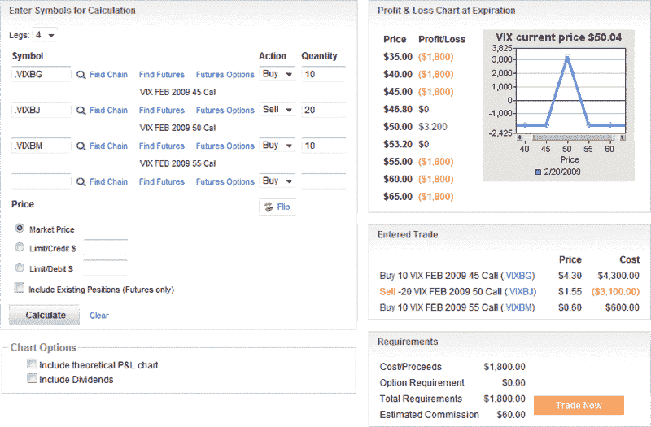

<!--yml

category: 未分类

date: 2024-05-18 17:59:36

-->

# VIX and More: A VIX Butterfly Play

> 来源：[`vixandmore.blogspot.com/2009/02/vix-butterfly-play.html#0001-01-01`](http://vixandmore.blogspot.com/2009/02/vix-butterfly-play.html#0001-01-01)

我通常避免提出交易想法，但这里有一个我知道至少有一个交易者今天肯定会下的赌注：一个 VIX 到期前的[蝴蝶](http://vixandmore.blogspot.com/search/label/butterfly)交易。

The butterfly trade highlighted below is for illustrative purposes only, but should explain the approach. The idea is simple. This butterfly trade will make a profit if the special opening quotation ([SOQ](http://vixandmore.blogspot.com/search/label/VIX%20SOQ)) for the VIX is between 46.80 and 53.20 – about 6.4% in either direction from the current VIX level of about 50\. In other words, if the VIX falls in a 12.8% band around the current price, the trade makes money.

当然，VIX 在一天的不到时间内可以发生很多事情，但就交易而言，今天交易时段还剩下大约 3 个半小时。明天开盘前，有几个重要的经济报告将要发布，包括 1 月份的建筑许可和房屋开工，以及 1 月份的工业生产和产能利用率。如果这些报告没有让世界末日更接近，或者表明所有的经济问题都突然解决了，那么 VIX 蝴蝶交易应该会表现良好。

Note that the maximum loss is about 56% of the potential maximum gain, which will happen if the VIX SOQ is ‘pinned’ at 50 tomorrow morning.

*[source: optionsXpress]*
