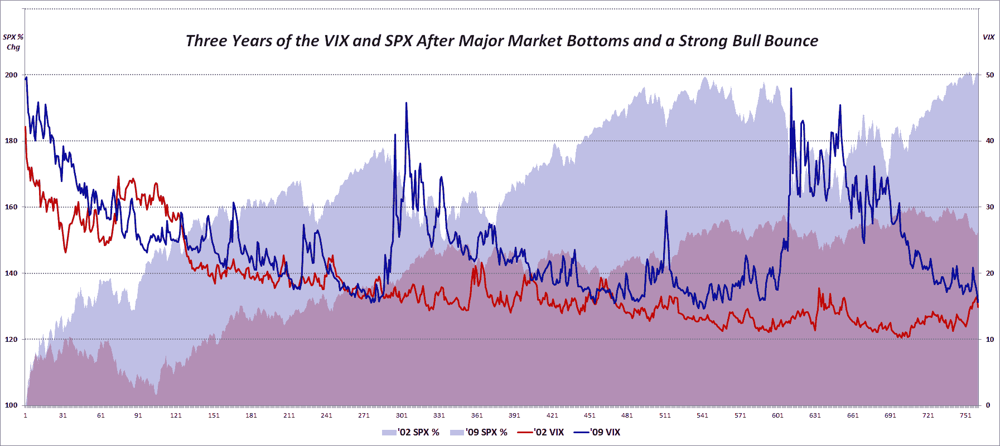

<!--yml

category: 未分类

date: 2024-05-18 16:36:05

-->

# VIX and More: A VIX of 15!?! Meet the New Reality

> 来源：[`vixandmore.blogspot.com/2012/03/vix-of-15-meet-new-reality.html#0001-01-01`](http://vixandmore.blogspot.com/2012/03/vix-of-15-meet-new-reality.html#0001-01-01)

当 VIX 最近一段时间内跌破 20.00 大关时，我感觉到许多交易员和投资者对市场的状态感到明显的不安。他们认为，低于 20 的 VIX 正在低估当前和未来市场环境中的风险。当 VIX 跌破 18.00 大关时，这种不安加剧了，现在 VIX 在 15.00 附近徘徊，我能感觉到很多人正准备拿起最近的农具，对 VIX 的离经叛道行为表示抗议。

我首先要承认，有许多令人困惑的地缘政治、宏观经济等因素对经济和股市构成了真正的威胁，但是我也相信投资者对过去的一些问题过于专注，以至于[可用性偏见](http://vixandmore.blogspot.com/search/label/availability%20bias)和[灾难印记](http://vixandmore.blogspot.com/search/label/disaster%20imprinting)影响了他们的判断，以至于他们无法将当前市场环境与过去的市场幽灵区分开来。

带着这样的想法，我制作了一个图表，展示了我们上次经历了一次剧烈的市场抛售和随后持续了三年的反弹时发生了什么。下图显示了 SPX 的百分比变化以及随后的三年中 VIX 的绝对水平。注意，从 2002 年到 2005 年，SPX 反弹了大约 53%；从 2009 年 3 月收盘至今，SPX 的当前反弹已经超过了 100%。

谈到 VIX，它在 2002 年始于 40 多一点，在 2009 年则是 40 多一点。注意，在这两次情况下，VIX 在牛市开始的短短一年内就跌到了十几。然而，随着 2002 年牛市的反弹，VIX 暴跌，大部分时间都在 10-13 的范围内，那轮牛市的头三年中位数为 15.30。然而，从 2009 年低谷的反弹与那次牛市完全不同，很少有跌至 15 以下的情况（尽管 2010 年和 2011 年偶尔也出现过）并且在同样的头三年牛市中，VIX 中位数为 22.84。

当然，并非所有的牛市都相同（并且有许多人不承认当前的反弹是一个真正的牛市），每个忧虑之墙都是由不同类型的石头堆砌而成，但是在某种程度上，投资者需要接受 VIX 为 15 的现实，特别是当我们考虑到过去两个月实际波动率一直[低于 10](http://vixandmore.blogspot.com/search/label/sub-10)的情况下。

*Related posts:

******

**披露声明：** 无*

数据来源：CBOE, Yahoo*
