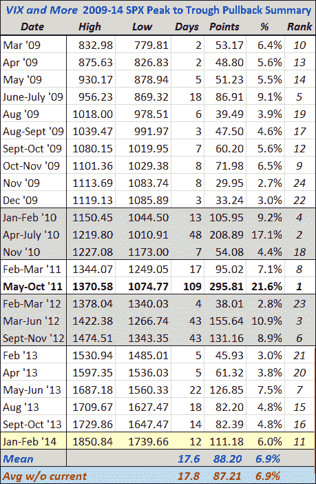

<!--yml

category: 未分类

date: 2024-05-18 16:11:11

-->

# VIX and More: A Very Middling Pullback, So Far

> 来源：[`vixandmore.blogspot.com/2014/02/a-very-middling-pullback-so-far.html#0001-01-01`](http://vixandmore.blogspot.com/2014/02/a-very-middling-pullback-so-far.html#0001-01-01)

最近几次市场回调，总有读者询问我更新那张自 2009 年 3 月股市触底以来追踪标普 500 指数回调的表格。

下面的表格捕捉了在目前几乎五年的牛市运动期间，从新高点到低谷的 24 个最显著的跌幅：

**来源：雅虎，VIX 和更多**

*注意，当前的峰谷跌幅为 6.0%，在跌幅幅度上，这波回调处于中间位置（24 个中的第 11 个），尽管由于 2010 年和 2011 年的大规模抛售，这个平均跌幅（平均值）低于这一时期的 6.9%，但这种平均值仍然远高于中位数。*

虽然最近的跌幅看起来很剧烈，但它实际上分两个阶段进行：1 月份后半程市场横盘至略微下跌；1 月底至 2 月初市场出现更剧烈的下跌。如果把当前回调的幅度与从高峰到低谷的持续时间对比，它将会正好落在[关于 1687 点的回调一切](http://vixandmore.blogspot.com/2013/06/all-about-pullback-from-spx-1687.html)的图表趋势线上。换句话说，如果当前回调在标普 500 指数 1739 点停止，那么在几乎所有方面都非常中等。

*话说回来，平均跌幅 6.9%将会把标普 500 指数带到 1723 点，而与 2011 年的 21.6%跌幅相匹配的回调将会把标普 500 指数一路带回 1451 点——一个自从 2013 年 1 月初以来就没有见过的水平。*

目前标普 500 指数为 1757 点，较昨天的低点高出大约 1%。虽然[新兴市场](http://vixandmore.blogspot.com/search/label/emerging%20markets)今天正在强劲反弹，但在周五发布[非农就业](http://vixandmore.blogspot.com/search/label/nonfarm%20payrolls)数据后，任何事情都有可能发生。

Related posts:

***披露：*** *无*
