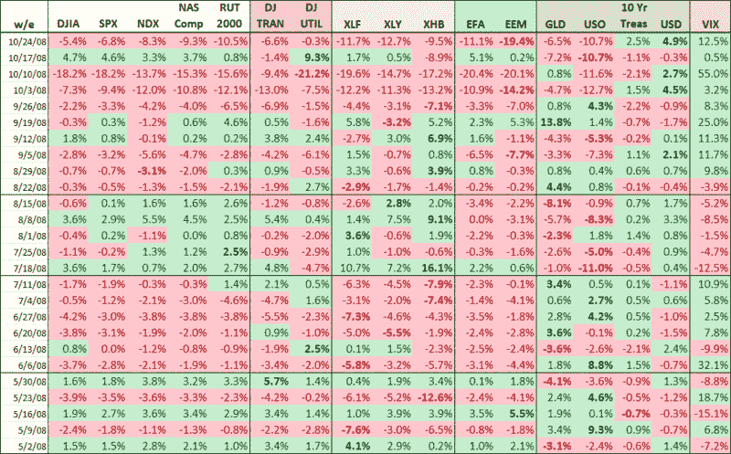

<!--yml

分类：未分类

日期：2024-05-18 18:18:31

-->

# 《VIX 和更多：过去六个月的每周审视》

> 来源：[`vixandmore.blogspot.com/2008/10/week-by-week-look-at-past-six-months.html#0001-01-01`](http://vixandmore.blogspot.com/2008/10/week-by-week-look-at-past-six-months.html#0001-01-01)

下面的图表通常保留在[订阅者通讯](http://vixandmoresubscriber.blogspot.com/)中，展示了我在密切关注的 17 个指数和 ETF 过去六个月的周表现快照。

我将让这个表格 largely 不加评论地呈现，除了指出我对每周的最大百分比变化（排除 VIX）进行了加粗，并将周数分成了四组，每组 5-10 周。

这张图表中有一些令人惊叹的数字，有一天当 VIX 达到 14 点几时，我们可以回顾一下这个时期发生了什么，微微一笑，知道我们坚持了下来。

来源：[VIX 和更多](http://vixandmore.blogspot.com/)
