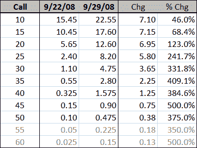

<!--yml

分类：未分类

日期：2024-05-18 18:24:02

-->

# VIX 和更多：VIX 看涨期权的一周生活

> 来源：[`vixandmore.blogspot.com/2008/10/week-in-life-of-vix-calls.html#0001-01-01`](http://vixandmore.blogspot.com/2008/10/week-in-life-of-vix-calls.html#0001-01-01)

上周我稍微谈到了[VIX 期权作为灾难保险](http://vixandmore.blogspot.com/2008/09/vix-options-as-catastrophe-insurance.html)的话题，并谈到了[VIX 期权](http://vixandmore.blogspot.com/search/label/VIX%20options)是如何基于[VIX 期货](http://vixandmore.blogspot.com/search/label/VIX%20futures)定价的，而不是媒体报价的现金/现货 VIX 指数。一周内可以发生很多事情。

在下面的图表中，我比较了 9 月 22 日 EDT 下午 2:30 左右和 9 月 29 日市场关闭时，行权价从 10 到 60 的 VIX 十月看涨期权的报价（使用买卖价的中点）。

在这一周中，VIX 从 31.74 跃升至 46.72，涨幅为 14.98 点，或增长了 47%。正如你所看到的，即使是深度实值[VIX 看涨期权](http://vixandmore.blogspot.com/search/label/VIX%20calls)（即 10 和 15 行权价）在绝对值上的变动也没有现金 VIX 的一半多。在价格波动之前低于现金 VIX 的 30 行权价，其变动仅约为现金 VIX 的四分之一。看向 45 行权价，那些 VIX 期权上涨了全部 0.75，或约为现金 VIX 当周变动的五分之一。

记录在案，从 9 月 22 日到 9 月 29 日，VIX 十月期货上涨了大约 21%，从略超过 25 点到略超过 31 点。

我将有很多话要说关于 VIX 期权和期货的行为，特别是在 9 月 29 日[VIX 波动](http://vixandmore.blogspot.com/search/label/VIX%20spikes)期间及其前后。

[注意：灰色数字表示没有出价，所以上面的计算是出价的一半]
