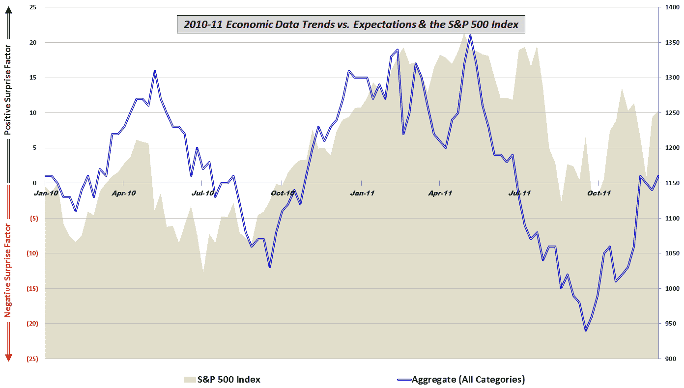

<!--yml

分类：未分类

日期：2024-05-18 16:46:23

-->

# VIX and More：美国数据与预期的综合视图

> 来源：[`vixandmore.blogspot.com/2011/12/aggregate-view-of-us-data-vs.html#0001-01-01`](http://vixandmore.blogspot.com/2011/12/aggregate-view-of-us-data-vs.html#0001-01-01)

昨天，我提出并（在某种程度上）回答了问题，[最近美国数据表现如何？](http://vixandmore.blogspot.com/2011/12/how-good-has-us-data-been-lately.html)

今天，我已经汇总了过去两年五组经济活动（制造业/一般，房屋/建筑，就业，消费者和价格/通货膨胀）相对于预期的表现，并呈现了这些数据和标普 500 指数。

正如下图所示，无论是数据还是 SPX，都已经回撤了自 4 月底（股票）至 5 月初（经济数据）的峰值以来的大约一半。

从图表中可以看出，从 4 月到 9 月，数据表现不佳，但在过去的 2 个半月里，数据表现优于股票。

尽管传统智慧认为股票领先经济基本面 6-9 个月，但这个图表并不支持这种观点。相反，现在至少一些欧洲的不安情绪似乎已经成为过去，我们将看到这两者中哪一个起到了主导作用，这将是很有趣的。

*[对于对此图表中包含的组件数据和使用的方法感兴趣的读者，鼓励查看下面的链接。对于那些想要了解更多关于构成我的综合数据计算的特定经济数据发布的细节的人，请查看[周图：经济数据年度总结（2010）](http://vixandmore.blogspot.com/2011/01/chart-of-week-year-in-economic-data.html)。]*

相关帖子：

******

***披露：*** *无*

*[来源：各种]* 
