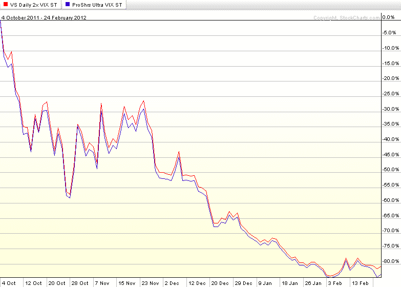

<!--yml

分类：未分类

日期：2024-05-18 16:38:15

-->

# VIX 与更多：关于 UVXY 的一切

> 来源：[`vixandmore.blogspot.com/2012/02/all-about-uvxy.html#0001-01-01`](http://vixandmore.blogspot.com/2012/02/all-about-uvxy.html#0001-01-01)

在过去的一周，媒体对 VelocityShares 每日 2 倍 VIX 短期 ETN（[TVIX](http://vixandmore.blogspot.com/search/label/TVIX)）的报道疯狂，类似的产品，ProShares Ultra VIX 短期期货 ETF（[UVXY](http://vixandmore.blogspot.com/search/label/UVXY)），却鲜有提及。这是不幸的，因为 UVXY 有很多值得推荐的地方。

我将 UVXY 和 TVIX 视为等同而非相等，主要是因为 UVXY 是 ETF 而 TVIX 是 ETN。这种区别的大小有争议，但可以说，通过 UVXY，投资者[持有](http://www.proshares.com/funds/uvxy_daily_holdings.html)VIX 前月和次月[VIX 期货](http://vixandmore.blogspot.com/search/label/VIX%20futures)，这些期货用于模拟标普 500 VIX 短期期货指数的两倍波动。对于 TVIX，情况略有不同，因为这个 ETN 是一种债务证券，其中瑞士信贷([CS](http://vixandmore.blogspot.com/search/label/CS))基本上承诺向投资者支付标普 500 VIX 短期期货指数的两倍表现。因此，对于瑞士信贷 TVIX 产品，存在这样的风险，即这些“优先未担保债务”在未来某些情况下可能不会得到偿还。

其他重要的[ETF 和 ETN 之间的区别](http://en.wikipedia.org/wiki/Exchange-traded_note)我这里不会深入探讨，但其中两个重要的区别是跟踪误差（ETF 不应该有任何跟踪误差）和税收处理，这通常是一个模糊的主题，容易产生不同解释。我应该知道：我娶了一个 CPA/税务律师，尽管事实如此，但我的税务知识仅比我单身时略有增长…

下图展示了自 2011 年 10 月 4 日 UVXY 推出以来 UVXY 和 TVIX 的表现。现在可能只是一个巧合，但 TVIX 在 UVXY 推出的同一天创下了 109.17 的 52 周高点。如下图所示，在过去的 4 个月零 3 周里，*UVXY 和 TVIX 都下跌了超过 80%*。在很大程度上，这两种证券在各种市场条件下都相互跟踪。这种关系在周二被瑞士信贷暂停 TVIX 创造单位时被打破。在过去的三个交易日中，UVXY 继续下跌了-11.6%，而供需失衡使 TVIX 的损失仅为 2.1%。

随着 TVIX 交易本质上作为[封闭式基金](http://vixandmore.blogspot.com/search/label/closed-end%20funds)，其价格在未来将更加难以预测，这应该会使 UVXY 对投资者更具吸引力。显然，在新的市场环境下，UVXY 已经在赢得粉丝，它在周四和周五创下了新的成交量记录，两天内超过 500 万股易手。就在两周前，UVXY 的成交量还约为 TVIX 成交量的 5%。截至周五，这一数字已激增至 38%。

随着 UVXY 的价格现在跌至 5 美元以下，我预计很快会看到反向拆股，甚至可能是 1-10 的反向拆股。

从 UVXY 的[招募说明书](http://www.proshares.com/media/documents/ProSharesCommodityCurrencyProspectus.pdf)来看：

> “如果赞助商认为基金在二级市场的每股价格已经跌出理想的交易价格区间，赞助商可以指导信托宣布对流通中的基金股份进行拆股或反向拆股，并在赞助商认为必要的情况下，相应地调整构成创建单元的基金股份数量。”*

ProShares 对它们的 ETF 进行反向拆股并不陌生。在[2010 年 4 月](http://www.proshares.com/resources/news/proshares_announces_reverse_share_splits_of_nine_etfs.html)，ProShares 对其九只 ETF 进行了反向拆股，其中大多数是 1-5 的拆股，但 UYG 和 ZSL 遭受了 1-10 的反向拆股。

在上周的最后几天，媒体将大部分注意力集中在 TVIX 和创建单位的暂停上。然而，对于交易员和投资者来说，他们的注意力似乎正在转向 UVXY。UVXY 日益增长的人气可能会有一些有趣的后果，其中最不重要的是，这可能为瑞士信贷考虑重新开放创建单位窗口提供了一个更有利的环境。

相关文章：

来源：[StockCharts.com]

***披露：*** *在撰写本文时做空 TVIX 和 UVXY*
