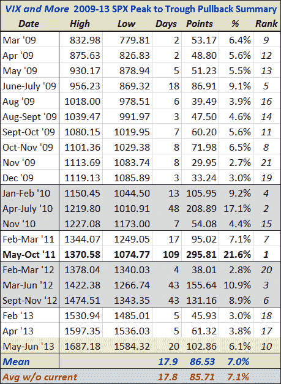
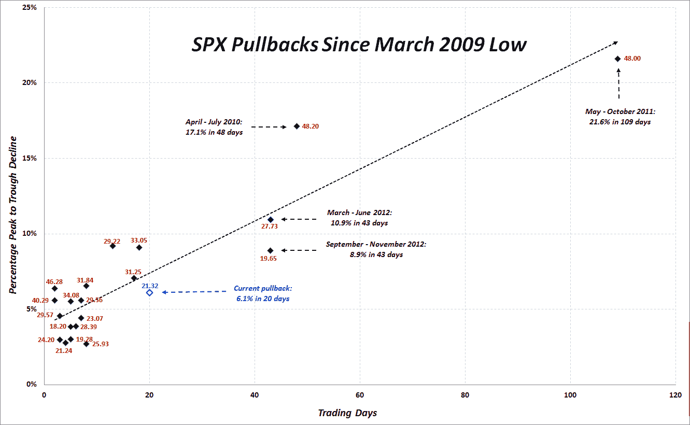

<!--yml

分类：未分类

date: 2024-05-18 16:15:11

-->

# VIX 和更多：关于 SPX 1687 的回调

> 来源：[`vixandmore.blogspot.com/2013/06/all-about-pullback-from-spx-1687.html#0001-01-01`](http://vixandmore.blogspot.com/2013/06/all-about-pullback-from-spx-1687.html#0001-01-01)

今天标普 500 指数下跌了 2.5%，在其低点比 5 月 22 日创下的历史高点 1687.18 低了超过 102 点。在这种情况下，我总是惊讶于收到多少要求我更新自 2009 年 3 月当前牛市开始以来定期发布的回调表格的请求。

如下面的表格所示，当前的峰值到谷值的下降幅度代表了从历史高点下跌 6.1%，在该期间内的二十一个回调中排名第十。在这个牛市中，平均回调幅度为 7.0%，暗示了 SPX 1568 的底部。中位数回调仅为 5.6%，此时指数将降至 1593。

这并不是说在股票反弹之前熊市必须承受一定的痛苦，或者说熊市必须在禁闭箱（平均峰值到谷值的下降持续 18 天，而中位数是 7 天）中度过一定的时间，但某个时候回调的严重性将开始吸引更多买家，增加市场情绪转变的可能性。

*[来源(s): CBOE，Yahoo，VIX 和更多]*

对于那些喜欢将数据压缩在一个图表中的朋友，我还更新了一张带有注释的图表，在该图表中，y 轴捕捉峰值到谷值的下降幅度（取反）的大小，x 轴记录该移动的持续时间。我还为每个点添加了峰值 VIX 作为红色标签，以及一条长的虚线作为所有数据点的最佳线性拟合。

请注意，当前的回调已经是过去四年多中的第五 longest。虽然到目前为止它已经引起了相当大的波动，但从今天的收盘价到日内低点还有 3.87 点的缓冲，在回调正式变得更加严重之前，回调还需要更加深入。

*[来源(s): CBOE，Yahoo，VIX 和更多]*

***披露(s):*** *无*
