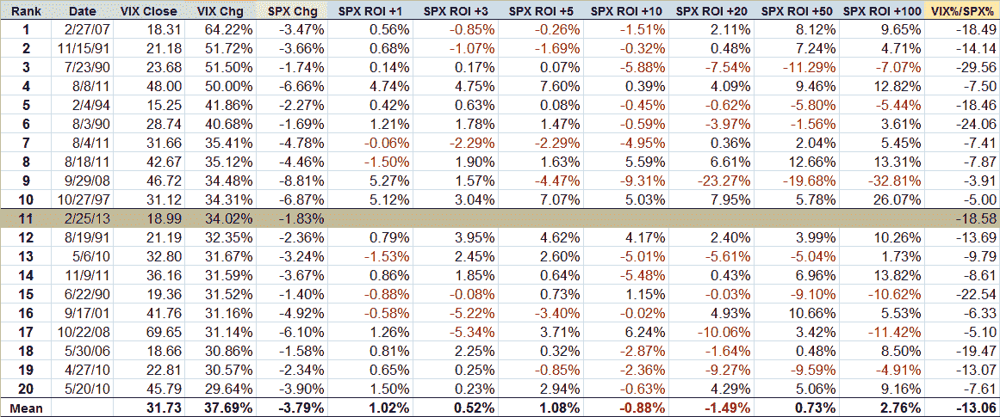

<!--yml

分类：未分类

日期：2024-05-18 16:18:38

-->

# VIX 和更多：史上 VIX 波动第 11 次高峰（以及 VIX 波动数据的宝库）

> 来源：[`vixandmore.blogspot.com/2013/02/all-time-vix-spike-11-and-treasure.html#0001-01-01`](http://vixandmore.blogspot.com/2013/02/all-time-vix-spike-11-and-treasure.html#0001-01-01)

今天是一个让很多人措手不及的日子。今天的交易进行到一半时，股票大体未变，然后当[意大利](http://vixandmore.blogspot.com/search/label/Italy)选举的结果开始传来时，一些股票开始出现抛售，暗示意大利议会可能出现僵局，或许需要进行新一轮的选举。

政府混乱很大程度上是因为两位引人入胜的政治人物的出现。其中一个是被称为硅谷的 Silvio Berlusconi 和他的人民自由党(PDL)，该党反对紧缩政策，并提出了大规模减税的政策，还讨论了离开[欧元](http://vixandmore.blogspot.com/search/label/euro)的可能性。更大的选举惊喜是 Beppe Grillo 和五星运动(M5S)，其中 Grillo 的民粹主义议程和反腐败信息与选民产生了共鸣。与大多数人的预期相比，Berlusconi 和 Grillo 对选举的影响要大得多，现在意大利与欧元区的关系令人质疑，欧元首次在六周内跌至 1.31 美元以下。

美国股市，之前似乎对[自动减赤](http://vixandmore.blogspot.com/search/label/sequestration)的威胁毫不在意，但今天下午由于对意大利政府未来的不确定性开始出现大幅抛售，在今天的交易后半段卖压加大，在最后一小时里，标普 500 指数下跌了超过 1%，VIX 波动上涨了 14.4%。

全天来看，标普 500 指数下跌了 1.83%，而 VIX 上涨了 34.02%。VIX 的 34%波动使其成为自 1990 年以来 24 年 VIX 历史数据中第 11 大日波动。

每个人心中第一个问题就是[VIX 波动](http://vixandmore.blogspot.com/search/label/VIX%20spikes)对股市价格和未来波动性的影响是什么。事实上，在经历了一次大的 VIX 日波动之后，历史记录 somewhat spotty（有些不确定）。下面的表格捕捉了一些自 1990 年以来日波动最大的 20 次 VIX 波动的数据。注意平均来说（在这里我得提醒大家，有可能在平均深度为一英寸的溪流中溺水），在经历大的 VIX 波动后，股票的表现在一周内（SPX ROI +1 到+5 天）通常优于，并且超过两个月表现也很好。然而，从一周到两个月，在经历大的 VIX 波动后，股票的表现就较差。

请注意，下面的表格是基于一个小型数据集的，如果从中提取某些数据集，对于在某些绝对水平或选定期间内的 VIX，甚至相对于 SPX 的变化幅度，可能会得出一些非常不同的结论。部分原因可能是样本量，部分原因可能是因为从这些数据中提取清晰解释并不容易。出于这些原因，我包含了大量相关数据，并鼓励读者自行得出结论。

*[来源：CBOE、Yahoo、VIX 和更多]*

对于那些对 VIX 波动、波动性以及其他与今天事件相关主题的更有说服力的研究和分析感兴趣的人来说，下面的链接是一个非常好的起点。

相关帖子：

**披露:** *写作时做空 VIX*
