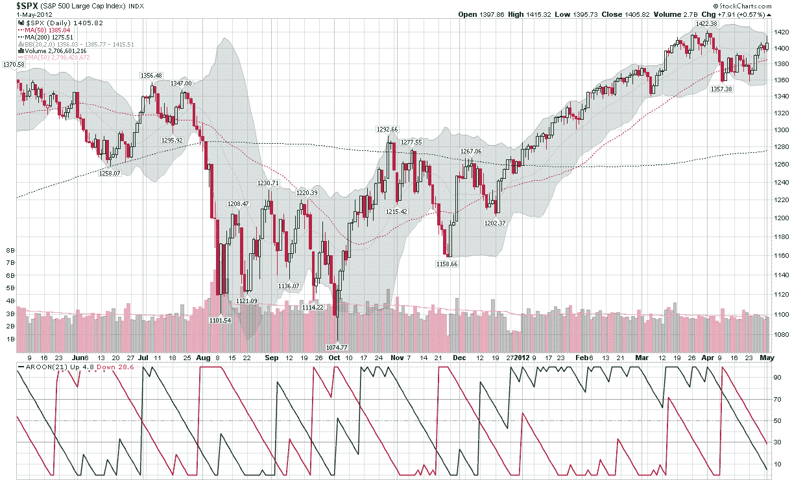

<!--yml

category: 未分类

date: 2024-05-18 16:31:18

-->

# VIX and More: An Aroon Stalemate for S&P 500 Index

> 来源：[`vixandmore.blogspot.com/2012/05/aroon-stalemate-for-s-500-index.html#0001-01-01`](http://vixandmore.blogspot.com/2012/05/aroon-stalemate-for-s-500-index.html#0001-01-01)

虽然过去三年两个月股市的确是呈上升趋势，但自 2008 年 4 月 2 日 SPX 达到 1422 的阶段性高点以来，标普 500 指数（SPX）一直难以保持在 1400 以上。

确定趋势强度有多种方法，其中一个非常受欢迎的方法是平均方向性指标（[ADX](http://vixandmore.blogspot.com/search/label/ADX)），由韦尔斯·威尔德开发，并于 1978 年的经典著作《技术交易系统的新概念》（[New Concepts in Technical Trading Systems](http://www.amazon.com/New-Concepts-Technical-Trading-Systems/dp/0894590278http:/store.stockcharts.com/products/new-concepts-in-technical-trading-systems)）中首次发表。

虽然 ADX 有很多优点，但我对另一种趋势评估工具——[Aroon](http://vixandmore.blogspot.com/search/label/Aroon)指标—— somewhat partial, which was developed by Tushar Chande. The Aroon 实际上是两个指标的组合，一个是 Aroon Up（下面主图表中的绿色线条），另一个是 Aroon Down（红线）。本质上，Aroon Up 和 Down 线衡量了 N 个周期的最高点和最低点与最近交易期的接近程度，采用 0-100 的刻度，100 表示在最近的一个交易期内达到了这个周期的最高点或最低点，0 表示在 N 个周期的窗口期的第一天达到了最高点或最低点。

默认情况下，Aroon 指标的时间框架通常表示为 25 个周期，但在某些图表软件中，默认周期为 14 个。由于我通常关注平均交易天数为 21 天的月份，下面的图表使用了我偏好的默认 Aroon 设置，即 21 天。

图表显示了过去一年中 SPX 的变化，自去年 12 月中旬以来，随着绿色线条（高于 50 或 70）的强劲上升趋势，多头最近开始显示出疲劳的迹象，因为自那次高点 1422 以来已经过去了 20 天。另一方面，红线显示，自 SPX 在 21 个周期内达到 1357 的低点以来，已经过去了 15 天。换句话说，过去三周内，21 天回顾期的最高点和最低点都没有出现，因为 SPX 在一个 65 点的范围内徘徊。结果是，绿色线条和红线都跌破了 30，表明没有任何有意义的看涨或看跌动力。

之所以 Aroon 指标作为趋势跟踪工具非常有效，部分原因在于，在发出趋势变化信号之前，它通常会等待 1/3 到 1/2 的回顾窗口期过去——这通常由绿色或红线穿越水平线 50 或 70 来表示。

正如现在所看到的，如果股票在未来四天继续横盘整理，那么周一可能会显示出一条上升的绿色线条，但是周五的就业报告、欧洲央行以及其他因素使得股票很难再维持一周左右的窄幅波动。

相关文章：

**来源：[StockCharts.com](https://www.stockcharts.com/)**

**披露：** *无**
