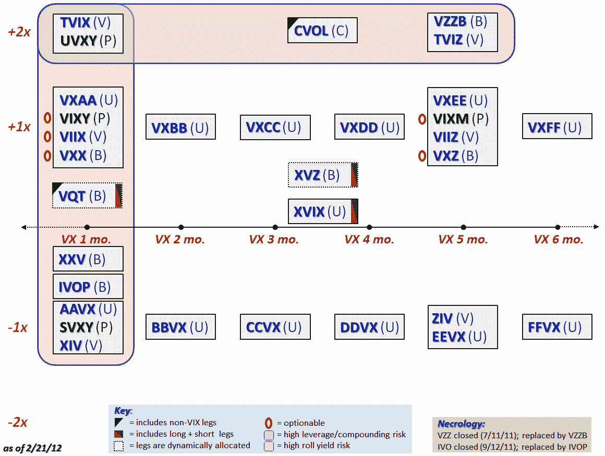

<!--yml

类别：未分类

日期：2024-05-18 16:39:12

-->

# 关于 VIX 的更多内容：更新版的 VIX ETP 指南

> 来源：[`vixandmore.blogspot.com/2012/02/updated-field-guide-to-vix-etps.html#0001-01-01`](http://vixandmore.blogspot.com/2012/02/updated-field-guide-to-vix-etps.html#0001-01-01)

随着[TVIX](http://vixandmore.blogspot.com/search/label/TVIX)的突然成功，似乎整个[VIX 交易所交易产品](http://vixandmore.blogspot.com/search/label/VIX%20ETN) (ETP)领域有很多新信徒。从 2009 年底的仅有两个产品([VXX](http://vixandmore.blogspot.com/search/label/VXX)和[VXZ](http://vixandmore.blogspot.com/search/label/VXZ))发展到 2010 年底的 12 个和 2011 年底的 31 个，VIX ETP 是一个增长行业。

对于那些在 VIX ETP 领域交易或投资的人来说，我认为下面的图表——一种指南——可能会有所帮助。图表的目的是主要通过映射目标持续时间和杠杆来区分各种 VIX 和基于波动性的 ETP。图表底部的关键强调了一些额外的区别，例如：

+   持有其组合中一些非 VIX 证券的 ETP 被一个黑色三角形标记。这些包括[VQT](http://vixandmore.blogspot.com/search/label/VQT)和[CVOL](http://vixandmore.blogspot.com/search/label/CVOL)，它们持有 SPX/SPY 的多头或空头头寸

+   包含多空 VIX 头寸的 ETP（VQT，[XVZ](http://vixandmore.blogspot.com/search/label/XVZ)和[XVIX](http://vixandmore.blogspot.com/search/label/XVIX)）被标记为一个红/绿矩形

+   带有虚线轮廓的 ETP（VQT 和 XVZ）有一个基于规则的波动性成分动态分配

+   红色的圆圈突出了目前可选择权的五个 VIX ETP

+   大的浅红色阴影区域包括所有使用 2x 杠杆的 ETP（没有 3x VIX ETP）

+   大的橙色阴影区域包括所有目标平均加权一个月持续时间的 ETP，因此特别容易受到[contango](http://vixandmore.blogspot.com/search/label/contango)和负[滚动收益率](http://vixandmore.blogspot.com/search/label/roll%20yield)在[VIX 期货](http://vixandmore.blogspot.com/search/label/VIX%20futures)部分的影响

还有一些其他的重要区别很难融入图表中，但其中一个我已经纳入的是用黑色字体标记[VIX ETF](http://vixandmore.blogspot.com/search/label/VIX%20ETF)（来自 ProShares），而所有的 ETN 都用蓝色字体。

为了完整性，我还 included a necrology of the two VIX ETPs that were closed last year. Interestingly, both were immediately succeeded with virtually identical products that trade under a similar ticker.

今后我担心下一轮 VIX ETP 可能会让我无法捕捉到我在这一页中所实现的同样详细程度，但至少现在，这是我研究 VIX ETP 的首选参考资料。

相关文章：

***披露(s):*** 写作时持有 XVZ 多头，VXX 和 TVIX 空头*
