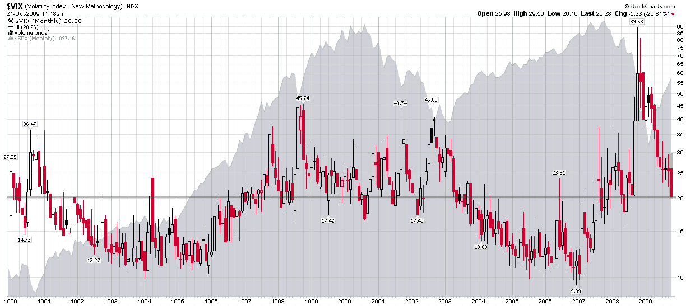

<!--yml

类别：未分类

日期：2024-05-18 17:25:43

-->

# VIX and More：定锚和 20 的恐慌指数

> 来源：[`vixandmore.blogspot.com/2009/10/anchoring-and-vix-of-20.html#0001-01-01`](http://vixandmore.blogspot.com/2009/10/anchoring-and-vix-of-20.html#0001-01-01)

我不能完全决定到底开心还是困惑，很多人似乎很在意芝加哥期权交易所波动指数（VIX）正接近 20。说实话，我感到这二者都有一些。在我开始写这个博客的时候，我决定把大量的注意力放在这个鲜为人知的指数上，大多数人都心知肚明，但大多数人都已经因为乏味而不再关注。当然那时候 VIX 大约是 10，市场上充斥着流动性，同时跟着一个波动指数感觉对市值不不太有用，就像用日晷测量「优赛恩·伯特」的成绩那里不太合适。

三年过去了，很多事情都发生了变化。我当然可以理解 VIX 在试图帮助人们量化金融危机中的恐慌方面所起的作用。当 VIX 达到 50、60、70 和 80 时，这些新的高潮传达了一个信息，情况正在变得更加糟糕 —— 或者说投资者愿意为了保护自己免受许多潜在的灾难性影响出现的场景付出昂贵的代价。

在市场开始恢复的时候发生了一个有趣的事情。我们开始听到各种各样的观点，认为 VIX 过低，仍然存在着实质性的风险等等。"VIX 过低" 的观点几个月前就开始有人提出，但是随着 VIX 接近 20 这种观点似乎开始聚集了一些力量。

[阿莫斯·特佛斯基（Amos Tversky）](http://en.wikipedia.org/wiki/Amos_Tversky) 和 [丹尼尔·卡尼曼（Daniel Kahneman）](http://en.wikipedia.org/wiki/Daniel_Kahneman) 历时 35 多年写就的一篇关于[定锚](http://en.wikipedia.org/wiki/Anchoring_and_adjustment)的重要论文就是来自于[不确定性下的判断：启发式和偏见](http://www.hss.caltech.edu/~camerer/Ec101/JudgementUncertainty.pdf)。按照作者的话来说：

**> “在很多情况下，人们都是从初始值开始进行估计，然后再做出调整，得出最终答案。初始值或者说起点可能来源于问题的表述，也可能是部分计算的结果。但无论哪种情况，这些调整通常是不足够的。也就是说，不同的起点会产生不同的估计值，而这些估计值是偏向于初始值的。我们把这种现象叫做定锚。”*

这和那些关注 [GOOG](http://vixandmore.blogspot.com/search/label/GOOG) 在 450 数值周围徘徊了一周又一周，认为他们会等到股票下跌到 400 时再买进以便十分廉价购买该股票的投资者的想法是一样的。问题是，当 GOOG 的价格超过了 500，所有围绕 450 数值的定锚都使大脑一直认为 500 太贵，不管 GOOG 从那个数值上升了多少。

转向 VIX，不仅所有那些 30、40、50 的读数最近已经深深印在了投资者的心理上，与金融危机和股市崩溃相关的所有情感动荡也同样如此。即使情况有所好转，论点是这样的，事情 possibly *这么* 好，*这么快* 在全球金融系统濒临悬崖边缘之后，这是可能的吗？简短答案是，定锚效应使得许多投资者难以适应新的价格范围和一系列新情况，随着情况的改变。这是为什么多头在下跌过程中仍然抱有希望，以及为什么永久看跌者市场反弹时改变他们的偏见有困难的原因之一。最后，这也是为什么许多人似乎不能相信 VIX 已经几乎跌到 20.00，而波动指数的终身（20 年）移动平均为 20.26 的原因。在波动性方面，我们正好处于 VIX 的终身移动平均值，这意味着投资者目前正在定价平均的风险和不确定性——从历史角度来看。

当然，如果一个人在过去 12 个月里定锚，VIX 将会达到历史最低点。相反，如果一个人在 2004-2006 年期间定锚，VIX 将处于第 99 个百分位，几乎达到历史最高点。

所以……拔起定锚，扬起帆，迎接新的波动性环境。

来源：[StockCharts]*
