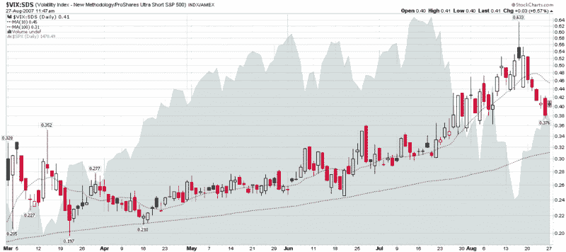

<!--yml

category: 未分类

date: 2024-05-18 19:01:17

-->

# [VIX 与更多：再看 VIX：SDS 比率](http://vixandmore.blogspot.com/2007/08/another-look-at-vixsds-ratio.html#0001-01-01)

> 来源：[`vixandmore.blogspot.com/2007/08/another-look-at-vixsds-ratio.html#0001-01-01`](http://vixandmore.blogspot.com/2007/08/another-look-at-vixsds-ratio.html#0001-01-01)

回到 8 月 10 日，当市场正在测试首轮低点时，我尝试了几个指标，我认为这些指标可能会帮助我更好地区分恐惧和波动性。我发布了一个[10 天图表](http://vixandmore.blogspot.com/2007/08/fear-vs-volatility.html)的其中之一，即 VIX:SDS 比率。

在过去的 2 周半时间里，我一直在关注这个比率，并注意到.633 的极端读数非常好地标志了最近的市场底部。我仍然不确定 VIX:SDS 比率在未来可能有多大用处，但我认为六个月的图表可能是对那些喜欢思考此类问题的人有趣的分析素材。如往常一样，欢迎评论。

作为一个快速提醒，SDS 是一只旨在跟踪标普 500 反向 2 倍的 ETF。更多信息请参考[ProShares](http://www.proshares.com/funds/sds)。

