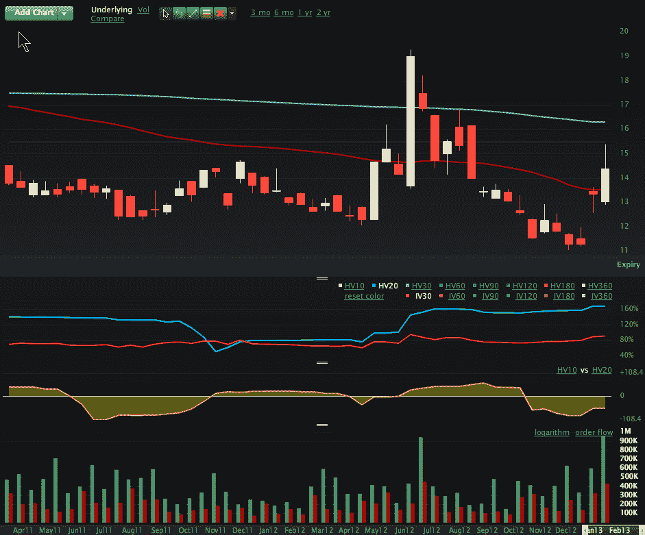

<!--yml

category: 未分类

date: 2024-05-18 16:17:13

-->

# VIX and More: Another Record in VIX Call Volume

> 来源：[`vixandmore.blogspot.com/2013/03/another-record-in-vix-call-volume.html#0001-01-01`](http://vixandmore.blogspot.com/2013/03/another-record-in-vix-call-volume.html#0001-01-01)

正好三周前的今天，我本以为我会通过一篇题为[Record VIX Options Volume and Large Purchases of VIX Calls](http://vixandmore.blogspot.com/2013/02/record-vix-options-volume-and-large.html)的文章在日内 break some news。结果，当日的总成交量统计出来后，2 月 26 日创下了[VIX 期权](http://vixandmore.blogspot.com/search/label/VIX%20options)总体成交量和[VIX 看涨期权](http://vixandmore.blogspot.com/search/label/VIX%20calls)的成交量的历史记录。

三周前的事件在今日 VIX 看涨期权成交量的新纪录面前看起来有点不那么令人印象深刻了。事实上，VIX 期权似乎正吸引着一群新的投资者的注意。事实上，在本月早些时候的[CBOE 风险管理会议](http://vixandmore.blogspot.com/2013/03/some-thoughts-on-cboe-rmc.html)上，有很多关于谁可能是负责 VIX 领域新增长（似乎与[VIX ETPs](http://vixandmore.blogspot.com/search/label/VIX%20ETN)驱动的成交量无关）的[VIX 期货](http://vixandmore.blogspot.com/search/label/VIX%20futures)和 VIX 期权的新的参与者的猜测。*[对冲基金、 proprietary trading firms、commodity trading pools/advisors、保险公司、债券交易员、外汇交易员和其他机构都是被提及的名字...]*

正如 VIX 通常的情况一样，今日看涨期权成交量远远超过了看跌期权成交量。今日看涨与看跌之比约为 2.2 比 1，略高于平均的 1.9 比 1。话说回来，根据[LivevolPro](http://www.livevolpro.com/)提供的数据，看跌买家的积极性似乎比看涨买家稍高一些，因为有 42%的看跌期权是在要价买入，而看涨期权的这一比例是 30%。

投资者总是在寻找对这些 VIX 期权交易的解释性覆盖。坦白说，在 3 月份 VIX 到期前一天，大部分期权活动都是大投资者在平仓 3 月份的仓位或试图影响明天开盘的特殊报价（[VIX SOQ](http://vixandmore.blogspot.com/search/label/VIX%20SOQ)），从而为 VIX 期权和期货设定结算价。由于这种低信噪比，到期前一天通常不是解读期权细节的高效时间，尽管我们处于 VIX 到期周的哪个阶段，肯定有一些人热衷于某种期权占卜。至少今天，我建议下面的链接可能会更有成果。

相关文章：

*[资料来源：LivevolPro.com]*

**披露事项：** *Livevol 和 CBOE 是 VIX 和 More 的广告商*
