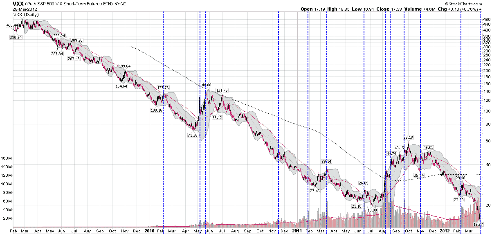

<!--yml

分类：未分类

日期：2024-05-18 16:34:35

-->

# VIX 和更多：VXX 交易量再次激增

> 来源：[`vixandmore.blogspot.com/2012/03/another-spike-in-vxx-volume.html#0001-01-01`](http://vixandmore.blogspot.com/2012/03/another-spike-in-vxx-volume.html#0001-01-01)

查看 iPath 标普 500 VIX 短期期货交易所交易凭证（[VXX](http://vixandmore.blogspot.com/search/label/VXX)）的成交量激增历史，很大程度上就像是在查看市场情绪、逆向思维和[心理学](http://vixandmore.blogspot.com/search/label/psychology)的历史。

自 2009 年 1 月推出以来，VXX 一直负责用其海妖之歌般的巨大利润承诺吸引 unwary 投资者，在他们即将到来的、不可避免的、就在拐角处的股票抛售前。不幸的是对于 VXX 的多头来说，所期望的 VIX 激增通常比预期的更加难以捉摸，而未能将自己绑在桅杆上的投资者通常最终会在自满的危险的岸边触礁。

查看 VXX 历史上最大的成交量激增（见下表）显示，几乎所有这些都是在 VIX 激增的顶部附近发生的，并使多头面临大幅下跌的风险。值得注意的是例外主要限于去年 8 月，当时 VXX 交易量的激增伴随着 VIX 和 VXX 的多阶段反弹的第一阶段。

如果历史能提供任何指导，当前 VXX 的交易量激增（昨日成交量达到 7500 万股，成交量超过该数的唯一股票是[BAC](http://vixandmore.blogspot.com/search/label/BAC)）很可能是愿望思考和对于昨日小激增的过度反应的某种组合，当时 VIX 十三交易日来首次超过 17.00。话又说回来，过去几年历史并没有很好地作为指导，尤其是[十三恐惧症](http://en.wikipedia.org/wiki/Triskaidekaphobia)患者应该总是准备最坏的情况…

相关文章：

**

*[数据来源：Stockcharts.com]*

***披露：*** *写作时持有 VXX 空头仓位*
