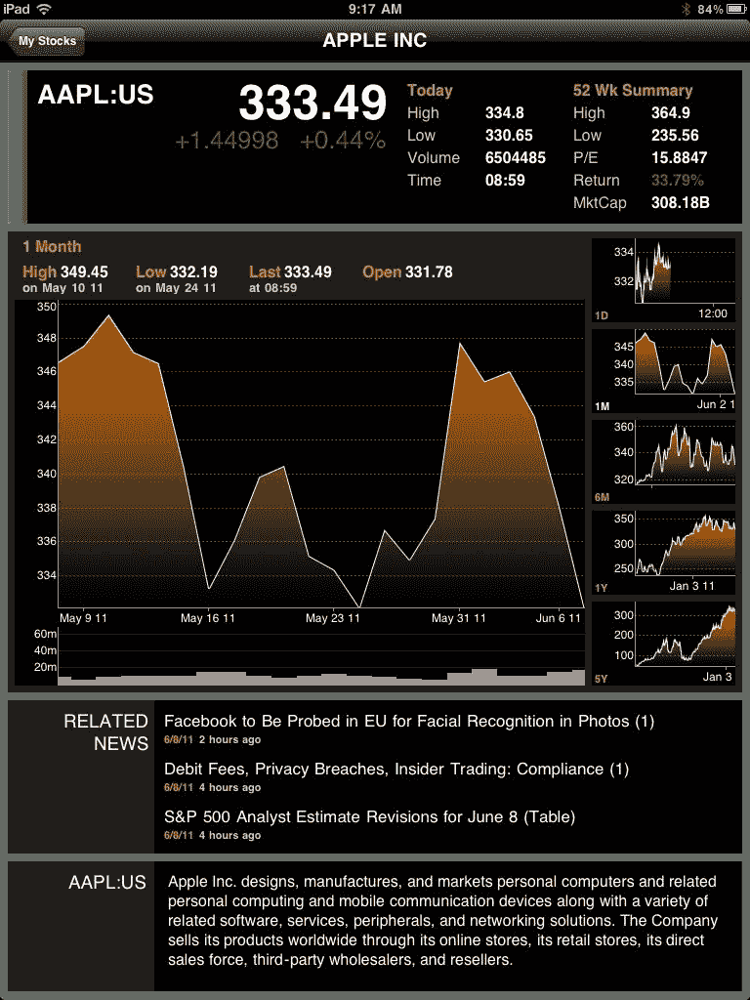

<!--yml

分类：未分类

日期：2024-05-18 16:49:44

-->

# VIX and More: Apple Products vs. Platform

> 来源：[`vixandmore.blogspot.com/2011/06/apple-products-vs-platform.html#0001-01-01`](http://vixandmore.blogspot.com/2011/06/apple-products-vs-platform.html#0001-01-01)

苹果公司（[AAPL](http://vixandmore.blogspot.com/search/label/AAPL)）的股票之所以与众不同，原因很多，其中最不重要的是股票在零售市场的强烈需求以及一大群定期在史蒂夫·乔布斯的神坛前顶礼膜拜的顾客狂热者。

把上述因素综合在一起，苹果在重大活动上发布重要产品的传统以及乔布斯和他的独特才能——擅长发布全新前沿产品，这些因素共同使得本周一的苹果全球开发者大会变得有趣——以及人们对这次大会的期待。

这些会议总是充满了关于苹果将宣布的下一个大事件的各种[传言和猜测](http://news.cnet.com/8301-27076_3-20069519-248/apple-wwdc-rumor-scorecard-2011-edition/)，这个事件将再次改变技术领域的格局。下一代[iPad](http://vixandmore.blogspot.com/search/label/iPad)什么时候发布？它将包括哪些新功能？下一代[iPhone](http://vixandmore.blogspot.com/search/label/iPhone) 5 何时上市？下一个 iOS 和 Mac OS 操作系统将做什么？它们对运行这些系统的设备有何影响？iCloud 是什么，它意味着什么？

最终，那些期待突破性新产品的人感到失望了。iPad、iPhone、iPod、MacBook、iMac、Mac Pro、AppleTV 等产品并没有出现在舞台上。相反，硬件爱好者们只能对这些局限于操作系统增强和 iCloud 的创新感到满足——这些创新并不是你在苹果商店排队等待、带回家后让你的朋友和家人都为之惊叹的东西。

讽刺的是，对硬件的狂热忽略了重点。新产品对苹果的业务至关重要，但最多只能让他们获得不保证持续的第一步优势。事实上，从战略角度来看，iCloud 对苹果未来的重要性远超过任何新产品，因为 iCloud 是一个平台策略，它增强了苹果全系列产品和服务的价值，包括未来的产品和服务的价值。

让我用个人经历来说明这一点。我在 PC 基础上拥有大约四分之一个世纪的计算机经验。在我购买我的第一个苹果产品，即 iPhone 之前，我可能拥有二十多台笔记本电脑。然而，当 iPad 2 出来时，我很容易就扩大了我的苹果产品阵容。现在我已经习惯了 iTunes 和 App Store，我开始更容易地考虑购买 MacBook 这样的产品。在 iCloud 上，所有这些设备无缝共享数据，这使得扩大我的苹果产品套件的数据论据变得更加有说服力。对我妻子来说，情况也类似，她最近才开始使用她的第一个苹果产品，即 iPad。她已经被彻底说服，很快就会买一个 iPod，然后我敢打赌，忽略 iPhone 将会非常困难。当她更换她的笔记本电脑时，我相当确定 MacBook Air 会赢得她的青睐——即使她现在甚至不知道它是什么。

我怀疑类似的事情正在全球范围内发生。我们中的许多人长期以来在以 PC 为中心的企业环境中工作，经常发现苹果产品在兼容性方面问题太多，不值得麻烦。它们被归类为玩具，而不是作为我们的主要计算设备。iCloud 给了苹果一个机会，不仅将那些坚持使用 PC 的人转变为令人兴奋的苹果产品和服务的用户，而且还将他们转变为可能成为平台革命的 iCloud 数据世界。设备无关的数据共享即将到来，微软([MSFT](http://vixandmore.blogspot.com/search/label/MSFT)),谷歌([GOOG](http://vixandmore.blogspot.com/search/label/GOOG))及其同类最好有一个强有力的替代方案——而且要快。

自从史蒂夫·乔布斯在上周一上台以来，AAPL 股票已经下跌了大约 3%。精明的投资者应该更多地思考布赖恩·阿瑟的[递增回报与商业新世界](http://www.santafe.edu/media/workingpapers/96-05-028.pdf)，而不是新产品发布的时间。

**[图片：彭博社为 iPad 设计]**

****披露(s)：** 写作时持有 AAPL 股票**
