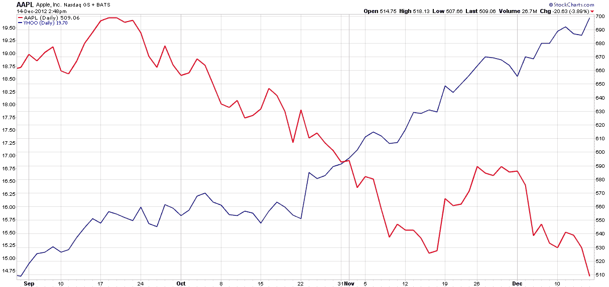

<!--yml

分类：未分类

日期：2024-05-18 16:21:14

-->

# VIX 和更多：苹果和雅虎再次相反移动

> 来源：[`vixandmore.blogspot.com/2012/12/apple-and-yahoo-moving-in-opposite.html#0001-01-01`](http://vixandmore.blogspot.com/2012/12/apple-and-yahoo-moving-in-opposite.html#0001-01-01)

多年来，要找到苹果([AAPL](http://vixandmore.blogspot.com/search/label/AAPL))和雅虎!([YHOO](http://vixandmore.blogspot.com/search/label/YHOO))相反移动的图表并不难。事实上，只要制作一个任意时间段的图表，有很大几率 AAPL 会上涨，YHOO 会下跌。

然而，过去三个月里，那种关系已经颠倒，是 YHOO 股票在上涨，而 AAPL 的运气却在衰落，如下面的图表所反映。

**来源：**[StockCharts.com]

YHOO 复苏的部分原因无疑是由于新 CEO 玛丽莎·梅耶尔，她已经开始了对公司的影响，并给了分析师和客户一些谈论的话题。事实上，我搜索了博客，结果发现自 2008 年以来，公司在这里还没有引起过引用，似乎正准备走[AltaVista](http://en.wikipedia.org/wiki/AltaVista)的老路。

科技领域的对冲交易可能是一场艰难的旅程，但对于那些愿意持有 YHOO 并做空 AAPL 的人来说，今天交易日的潜在大赢机会仍然存在。

相关文章：

**披露：***在撰写本文时，持有长期 YHOO 和短期 AAPL*
