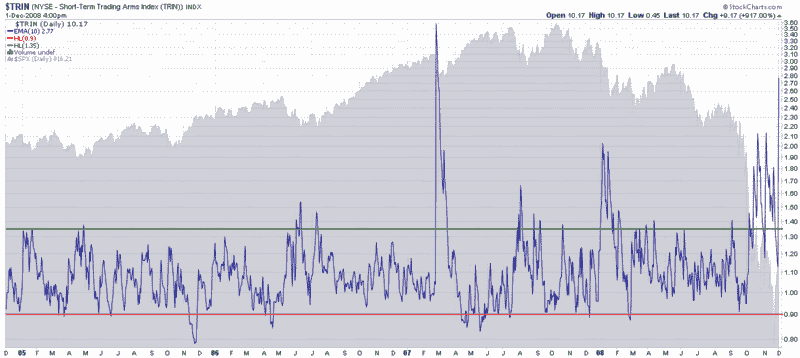

<!--yml

分类：未分类

日期：2024-05-18 18:12:57

-->

# VIX 和更多： Arms 指数极度扩展

> 来源：[`vixandmore.blogspot.com/2008/12/arms-index-extremely-extended.html#0001-01-01`](http://vixandmore.blogspot.com/2008/12/arms-index-extremely-extended.html#0001-01-01)

Arms 指数或[TRIN](http://vixandmore.blogspot.com/search/label/TRIN)是我密切关注的短期至中期设置的指标。这个结合了上涨股票与下跌股票的比例以及上涨成交量与下跌成交量的指标是一个相对可靠的逆向信号。

从十月底以来，Arms 指数已经产生了许多历史上高的信号。在下面的图表中，我使用了一个 10 天的指数移动平均作为平滑因子。请注意，TRIN 的 10 天 EMA 似乎昨天达到了顶峰，这种方式在历史上提供了优秀的买入机会。对我来说，昨天的 TRIN 顶峰暗示着 11 月 21 日**的底部很可能保住。空头们小心…

*[来源：StockCharts]*
