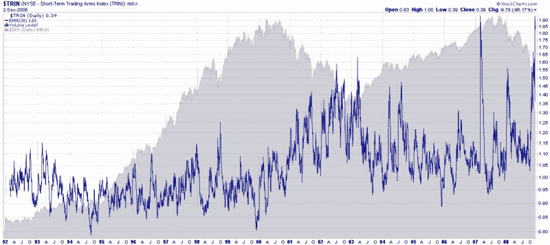

<!--yml

分类：未分类

日期：2024-05-18 18:12:47

-->

# VIX 和更多：回溯到 1992 年的 Arms 指数

> 来源：[`vixandmore.blogspot.com/2008/12/arms-index-going-back-to-1992.html#0001-01-01`](http://vixandmore.blogspot.com/2008/12/arms-index-going-back-to-1992.html#0001-01-01)

我很高兴看到昨天的[Arms 指数极度延伸](http://vixandmore.blogspot.com/2008/12/arms-index-extremely-extended.html)的文章受到了这么多关注。

一位读者提出的一个担忧是，我关于 Arms 指数（[TRIN](http://vixandmore.blogspot.com/search/label/TRIN)）的图表只回顾了四年的历史，所以当前熊市之前的历史背景完全是由牛市读数组成。因此，今天的图表一直追溯到 StockCharts.com 可用的 TRIN 数据之初。

在下面的图表中，17 年的 TRIN 数据使得 10 日 EMA 周期如此压缩和难以阅读，以至于我不得不将昨天的 10 日指数移动平均期延长至 30 日 EMA。幸运的是，由于它是 EMA 而不是 SMA，无论是 10 天、30 天还是 50 天的 EMA 周期，TRIN 周期的峰值几乎相同。

我还从这个长期图表中移除了红色和绿色的水平线，以反映 TRIN 在 2000 年之前平均值较低，在 2000-2003 年的熊市中呈上升趋势，并且在 2004 年至 2008 年似乎找到了一个新的平均值。因此，从多年的时间框架来看，TRIN 最好以相对术语而不是绝对术语来考虑。

正如我昨天所提到的图表所示，TRIN 指数的剧增“历史上提供了极佳的买入机会”。低的 TRIN 读数从市场时机的角度来看也有一定的价值，但这些信号通常不如高的 TRIN 读数那样稳健。最后，TRIN 在预测市场转折点方面远非完美，但它确实有足够准确的历史记录，值得关注。正如我昨天所提到的，TRIN 最适合短期到中期交易设置。

来源：[StockCharts](http://vixandmore.blogspot.com/search/label/StockCharts)
