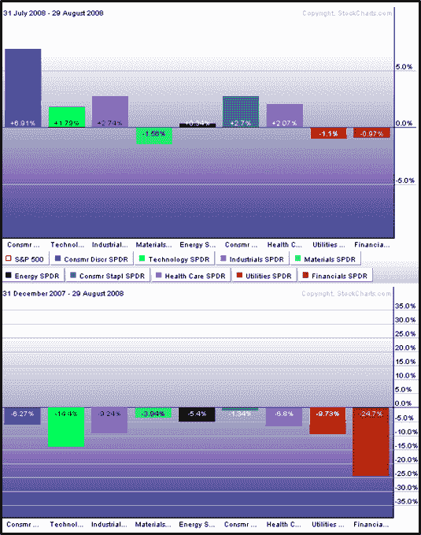

<!--yml

分类：未分类

日期：2024-05-18 18:28:29

-->

# 波动率指数与更多内容：八月板块回顾

> 来源：[`vixandmore.blogspot.com/2008/09/august-sector-recap.html#0001-01-01`](http://vixandmore.blogspot.com/2008/09/august-sector-recap.html#0001-01-01)

八月是标普 500 指数大部分时间横盘震荡的一个月，但在构成指数的各种板块中发生了很多事情。下面的图表显示了 2008 年前八个月九个板块的标普 500 行业指数(SPDRs)的表现（底部）和八月份的表现（顶部）。

在正面因素中，消费品行业的转好([XLY](http://vixandmore.blogspot.com/search/label/XLY))显然是推动标普 500 指数(SPX)近期正面动量的关键。同样值得关注的是，还有其他四个行业在八月份超越了指数：消费品必需品([XLP](http://vixandmore.blogspot.com/search/label/XLP)), 医疗保健([XLV](http://vixandmore.blogspot.com/search/label/XLV)), 工业([XLI](http://vixandmore.blogspot.com/search/label/XLI)), 和科技([XLK](http://vixandmore.blogspot.com/search/label/XLK))。

在过去几个月的很多时候，当标普 500 指数上涨时，能源([XLE](http://vixandmore.blogspot.com/search/label/XLE))和材料([XLB](http://vixandmore.blogspot.com/search/label/XLB))通常是在相反的方向移动。在八月，金融板块([XLF](http://finance.google.com/finance?q=xlf))也在拖累指数。

密切关注消费者的表现，以获取更多关于九月行业领导力和整体市场强度的线索。

[来源：StockCharts]
