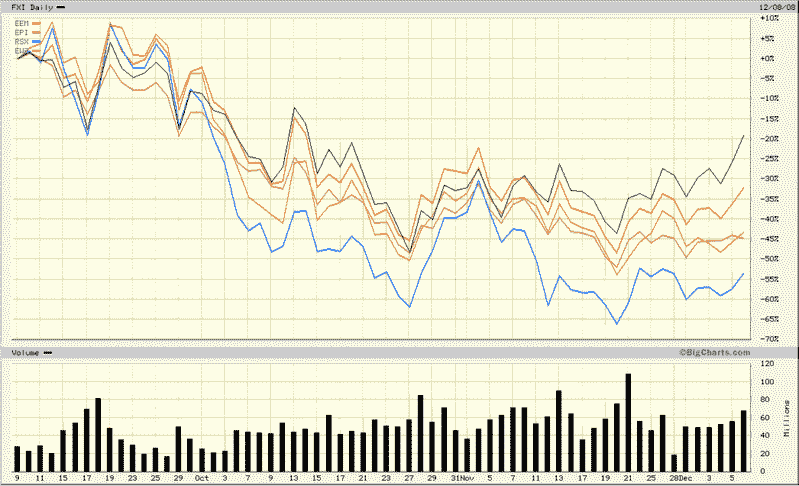

<!--yml

分类：未分类

日期：2024-05-18 18:11:51

-->

# VIX and More: BRIC Update: China a Leader or Outlier?

> 来源：[`vixandmore.blogspot.com/2008/12/bric-update-china-leader-or-outlier.html#0001-01-01`](http://vixandmore.blogspot.com/2008/12/bric-update-china-leader-or-outlier.html#0001-01-01)

我在过去几周内多次评论过重新崛起的中国股市，最近一次是在[中国即将突破？](http://vixandmore.blogspot.com/2008/12/china-about-to-break-out.html)。现在中国股票([FXI](http://vixandmore.blogspot.com/search/label/FXI)，黑色线)似乎正在反弹，一个重要的问题是这是孤立的现象，还是也会影响其他[新兴市场](http://vixandmore.blogspot.com/search/label/emerging%20markets)经济体的现象。

如下图所示，中国股票的上涨明显超过了新兴市场股票最近的反弹([EEM](http://vixandmore.blogspot.com/search/label/EEM)，橙色线)。然而，[BRIC](http://vixandmore.blogspot.com/search/label/BRIC)集团的另外三个成员国却是中国和广泛的新兴市场群体中落后最多的。毫不奇怪，资源丰富的俄罗斯([RSX](http://vixandmore.blogspot.com/search/label/RSX)，蓝色线)是 BRIC 国家中最大的落后者，而印度([EPI](http://vixandmore.blogspot.com/search/label/EPI))和巴西([EWZ](http://vixandmore.blogspot.com/search/label/EWZ))虽然落后于更广泛的新兴市场指数，但表现优于俄罗斯。

增长中的国内需求和大规模政府刺激计划是否会导致中国特有的反弹，还是帮助全球其他经济体一道复苏，这个问题可能很快就有答案。与此同时，中国在全球相对表现强劲，其他新兴市场经济体应该受到密切关注，以获取反弹的地域广度的线索。

*[来源：BigCharts]*
