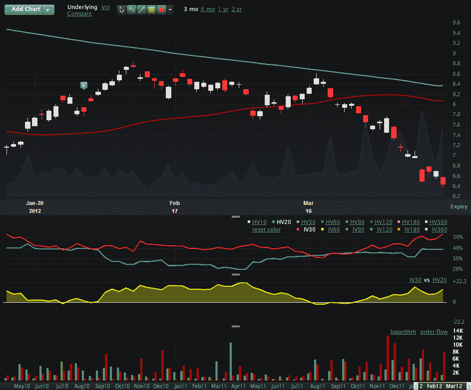
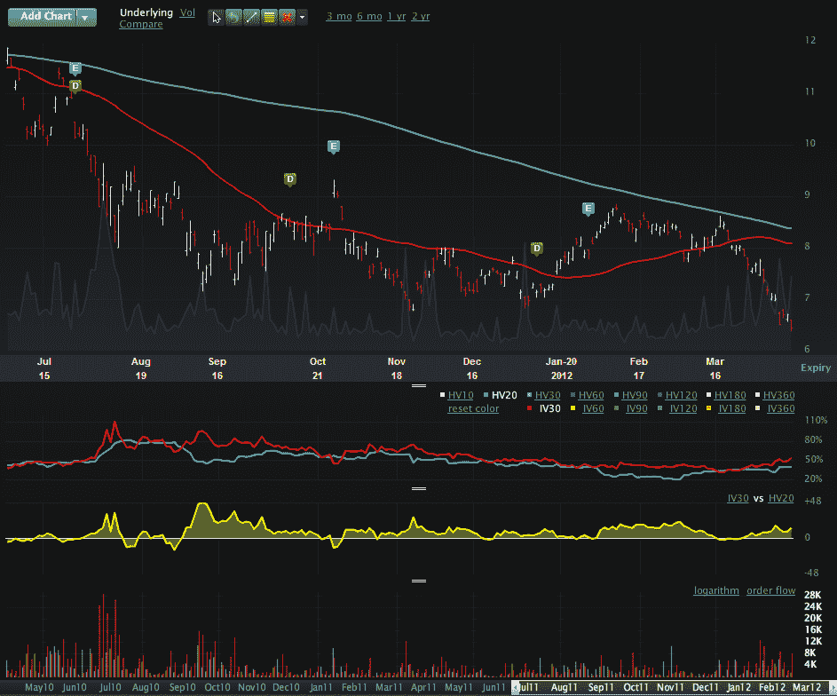

<!--yml

分类：未分类

日期：2024-05-18 16:32:51

-->

# VIX 和更多：桑坦德银行终于解决了一个大问题：它的股票代码

> 来源：[`vixandmore.blogspot.com/2012/04/banco-santander-finally-tackles-one.html#0001-01-01`](http://vixandmore.blogspot.com/2012/04/banco-santander-finally-tackles-one.html#0001-01-01)

在[西班牙](http://vixandmore.blogspot.com/search/label/Spain)坚定地成为[欧洲主权债务危机](http://vixandmore.blogspot.com/search/label/European%20sovereign%20debt%20crisis)第 N+1 幕的焦点时，我注意到西班牙最大、最重要的银行桑坦德银行([STD](http://vixandmore.blogspot.com/search/label/STD))昨天宣布，公司终于解决了我认为的一个严重被忽视的问题，即其股票代码。在无数次会议和电话会议后，市场和公关人员现在可以宣称一个小小的胜利，因为桑坦德银行表示，将从 2012 年 6 月 14 日起，将美国存托股份在纽约证券交易所的股票代码从“STD”更改为“SAN”。

与此同时，交易员继续青睐 STD 看跌期权和西班牙第二大银行 BBVA 看跌期权，这两者的期权市场比西班牙 ETF[EWP](http://vixandmore.blogspot.com/search/label/EWP)更有流动性。

下面的顶部图表显示，在过去两周左右的时间里，STD 的看跌期权活动（图表底部红色柱状图）急剧上升。然而，下面的图表将最近的选择权活动置于主权债务危机的 8 月-10 月高峰之中，并从 2011 年 7 月 1 日的图表中显示，8 月 4 日-8 月 11 日当周的看跌期权活动（每天 28,791 份合约）和隐含波动率（111）达到峰值。

至于期权交易者来说，当前的情况，虽然充满了潜在的雷区，但与六个月前即将到来的挑战相比，仍然相形见绌。

当然，一个新的股票代码并不能帮助桑坦德银行及其整体面临的核心问题，但它至少可以减少一些窃笑...

*[VIX 和 More 偶尔会倾向于幽默。想了解更多关于这些努力，请查看带有“[轻松一面](http://vixandmore.blogspot.com/search/label/lighter%20side)”标签的文章。]*

相关文章：

**

**

*[来源(s): LivevolPro.com]*

**披露(s):** *当前持有 STD 和 BBVA 的短仓*
