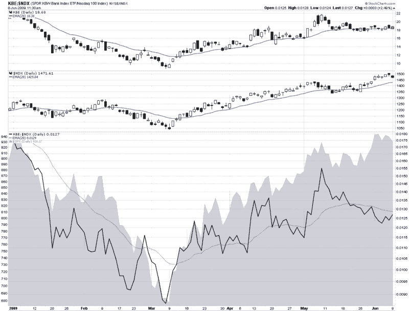

<!--yml

分类：未分类

日期：2024-05-18 17:44:03

-->

# VIX 和更多：银行、大型科技股和领导权

> 来源：[`vixandmore.blogspot.com/2009/06/banks-large-cap-tech-and-leadership.html#0001-01-01`](http://vixandmore.blogspot.com/2009/06/banks-large-cap-tech-and-leadership.html#0001-01-01)

就在一个月前的今天，在[银行对比科技](http://vixandmore.blogspot.com/2009/05/banks-vs-technology.html)一文中，我提到了科技与金融的分歧，并指出，“到目前为止，金融股（[XLF](http://vixandmore.blogspot.com/search/label/XLF)）引领市场的表现比科技股（[XLK](http://vixandmore.blogspot.com/search/label/XLK)）激发空头情绪做得更好。”

快进一个月，这种分歧完全颠倒过来。在下面的图表中，我关注的是以[KBE](http://vixandmore.blogspot.com/search/label/KBE)银行 ETF 形式表现的金融股和以纳斯达克 100 或[NDX](http://vixandmore.blogspot.com/search/label/NDX)为代表的大型科技股。

结果证明，5 月 8 日（原文发布日），是银行 ETF 的最高点。自那以来，银行缓慢地下行（顶部图表），即使大型科技股（中间图表）和标普 500 指数（底部灰色区域图表）一直在创出新高。领导权的转变或许最好由图表底部的一条实线来表示，该线追踪 KBE 与 NDX 的比率。在 3 月、4 月和 5 月初，这个比率非常准确地反映了标普 500 指数的走势。

然而，在过去四周的时间里，领导权从银行转向了大型科技股，比率开始下降，而标普 500 指数却继续创出新高。

我发现特别有趣的是，不仅仅是银行的相对表现下降，而且银行与科技在同一日走向不同方向的情况也变得越来越普遍。今天就是这样，过去的六天中有五天也是如此。

我不惊讶于领导权从金融股转移到大型科技股，但正如我一个月前所说，除非这两个板块能够同步上涨，我不认为市场会取得任何显著的额外收益。

来源：[StockCharts]
