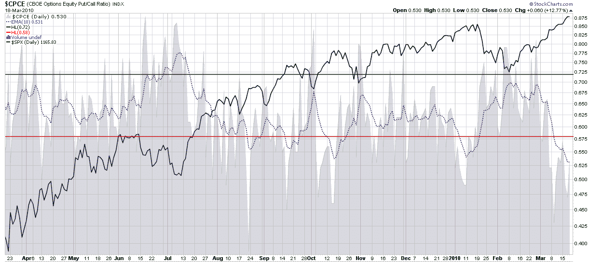

<!--yml

分类：未分类

日期：2024-05-18 17:13:43

-->

# VIX 和更多：熊市受到低 CBOE 股指看跌/看涨比率的鼓舞

> 来源：[`vixandmore.blogspot.com/2010/03/bears-emboldened-by-low-cboe-equity-put.html#0001-01-01`](http://vixandmore.blogspot.com/2010/03/bears-emboldened-by-low-cboe-equity-put.html#0001-01-01)

老实说，我今天早上并没有调查我们的熊朋友们，所以我真的不知道它们是否受到了低 CBOE 股指看跌/看涨比率([CPCE](http://vixandmore.blogspot.com/search/label/CPCE))的鼓舞，但它们应该会的。

我观察股指看跌/看涨比率的首选方式是使用 10 日指数移动平均（EMA）作为平滑因子。10 日 EMA 产生了下面图表中的虚线蓝色线条，目前处于一个月低点，这意味着看多投资者现在可能更激进地使用看涨期权，并且不太担心通过看跌保护来管理风险。图表显示，8 月、9 月、10 月和 1 月的先例低点都预示着有力的回调。看跌/看涨极端历史的例子表明，现在又一场回调即将到来。

熊市是否真的受到了鼓舞，甚至懒得关注看跌/看涨比率，对多方来说这似乎是一个不错的时机，可以获利了结并去享受春分。

关于相关主题的更多信息，读者们被鼓励去查看：

*[来源：StockCharts]*

***披露（Disclosure）***：*无*
