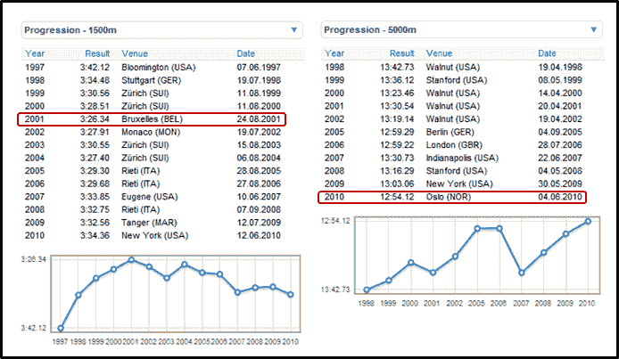

<!--yml

分类：未分类

日期：2024-05-18 17:08:04

-->

# VIX and More: 贝纳德·拉加特和交易策略

> 来源：[`vixandmore.blogspot.com/2010/06/bernard-lagat-and-trading-strategy.html#0001-01-01`](http://vixandmore.blogspot.com/2010/06/bernard-lagat-and-trading-strategy.html#0001-01-01)

周末我有机会通过电视观看[贝纳德·拉加特](http://en.wikipedia.org/wiki/Bernard_Lagat)在纽约 adidas 大奖赛上跑 1500 米。就在一周前，拉加特在奥斯陆打破了 5000 米新的美国纪录，这次他跑了一场战术上强劲的比赛，但最后时刻被超越，以第五名完赛。

在 2007 年，拉加特在 1500 米和 5000 米项目上都获得了世界冠军，这位 35 岁的运动员现在可能更适合跑更长的距离，而不是 1500 米。下面图表展示了拉加特在过去十多年间的进步。注意，拉加特在 2001 年达到了 1500 米项目的高峰，从那时起他的成绩逐渐放慢。然而，尽管拉加特的速度可能正在下降，但他的耐力在提高，证据就是他在 2001 年跑 5000 米的成绩比现在慢了 36 秒。

观看比赛后，我意识到类似的事情也发生在了我的交易中——至少从 anecdotal 证据来看，许多其他交易员也遇到了。2001 年，我大部分交易都是日内交易，但随着我的对手变得更年轻、更快、技术更先进，我发现自己像拉加特一样，将重点放在了更长[时间跨度](http://vixandmore.blogspot.com/search/label/time%20horizon)的交易上，我的技能和经验比对抗高频交易群体要更匹配。

虽然[卡洛斯·洛佩斯](http://en.wikipedia.org/wiki/Carlos_Lopes)在 37 岁时赢得了奥运会马拉松，但我几乎可以保证[尤赛恩·博尔特](http://en.wikipedia.org/wiki/Usain_bolt)在 2024 年奥运会上不会赢得 100 米。同样，对我来说，当我更适合长距离项目时，返回日内交易是没有意义的。

作为交易员，我们每个人都需要知道我们最佳的时间跨度。当然，继续在各种时间框架内实验策略是很重要的，但最终我们需要在特定的时间框架内成为专家，这个时间框架最适合我们的技能和个性，同时为我们的最佳时间跨度可能是一个移动目标做好准备，因为我们积累了新的知识和专业知识。

*[顺带一提，我未来打算更频繁地涉足隐喻和类比的领域* *以便* *为讨论交易以及特别是波动性提供一个更广阔的背景。有了这个想法，我决定给这些文章（以及今天的文章和一些之前的努力）贴上“[farther afield](http://vixandmore.blogspot.com/search/label/farther%20afield)”的标签。让旅程开始吧.]*

有关相关主题的更多信息，读者们被鼓励去查看：

*[来源：DiamondLeague.com]*

***免责声明(s):*** *无*
