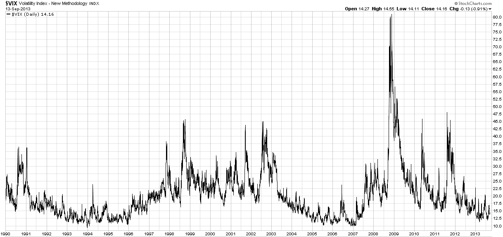

<!--yml

类别：未分类

日期：2024-05-18 16:13:28

-->

# VIX and More: 2013 最佳 VIX/波动性/风险会议？

> 来源：[`vixandmore.blogspot.com/2013/09/best-vixvolatilityrisk-conference-of.html#0001-01-01`](http://vixandmore.blogspot.com/2013/09/best-vixvolatilityrisk-conference-of.html#0001-01-01)

我敢大胆预测，第二届[CBOE 风险管理会议（RMC）欧洲分会](http://www.cboermceurope.com/)，将于 9 月 30 日至 10 月 2 日在葡萄牙辛特拉的[Penha Longa 度假村](http://www.penhalonga.com/en/Photo-Tour)举行，将是那些对 VIX、波动性、风险等相关主题感兴趣的人参加的最佳会议。

虽然 RMC 欧洲分会拥有令人印象深刻的[演讲者](http://www.cboermceurope.com/speakers.html)名单和一个[议程](http://www.cboermceurope.com/agenda.html)，应该会吸引任何《VIX 和更多》的读者，但今年 RMC 欧洲活动的场地几乎是无与伦比的。我了解到 Penha Longa 度假村的房间正在迅速预订中，所以我敦促任何欧洲读者（除了那些有兴趣飞往更远的目的地的读者）尽早[预订](http://www.cboermceurope.com/)，而不是晚些时候。

一些值得注意的演讲者包括：

+   威廉·布罗德斯基，CBOE 执行主席

+   保罗·唐纳文，瑞银全球经济学家

+   杰里·福勒，法国巴黎银行股票及衍生品策略部门负责人

+   Buzz Gregory，高盛股票衍生品策略师

+   谢尔登·纳滕伯格，芝加哥交易公司 LLC 教育总监

一些引起我注意的会议包括：

+   波动率表面：偏斜和期限结构

+   VIX ETPs，波动市场之间的相互关系以及对投资者和交易者的含义

+   超越 VIX：跨资产类别交易波动性和方差

+   机构期权和波动产品使用的趋势

+   优化投资组合对冲策略

+   利用期权空头头寸管理和降低股票投资组合的波动性

+   波动性作为资产类别的圆桌讨论

如果你想在会议之外找些事情做，你总是可以前往纳扎尔去寻找高达 100 英尺的浪花冲浪([视频链接](http://vimeo.com/58536269))，领略里斯本的历史和美食（更不用说当地的饮料选择，从[维霍 Verde](http://www.nytimes.com/2013/07/03/dining/vinho-verde-portuguese-for-cheap-and-cheerful.html)到[波尔图葡萄酒](http://en.wikipedia.org/wiki/Port_wine))，或者查看[风景优美的当地高尔夫选项](http://www.penhalonga.com/en/Golf)。

在美国，RMC 每两年在佛罗里达举行一次，在加利福尼亚举行一次，通常在 2 月或 3 月底举行。明年将是美国 RMC 第 30 届年度会议，将于 3 月 17 日至 19 日在佛罗里达州博尼塔 springs 的海悦 Regency Coconut Point 举行。

让我感到很遗憾，今年我将不会参加 RMC 欧洲会议，但我计划在 3 月前往布尼塔泉，并且无论如何我都会找到去 2014 RMC 欧洲会议举办地的路，无论天堂还是地狱，无论洪水还是干旱。

对于那些能够参加 RMC 欧洲的人来说，我非常想听听你们在波动性领域的经历和一些主要的收获。

**来源：** [StockCharts.com](https://www.stockcharts.com/)

相关文章：

**披露声明：** *CBOE 是 VIX 和 More 的广告商；VIX 和 More 是 CBOE 风险管理会议的赞助商*
