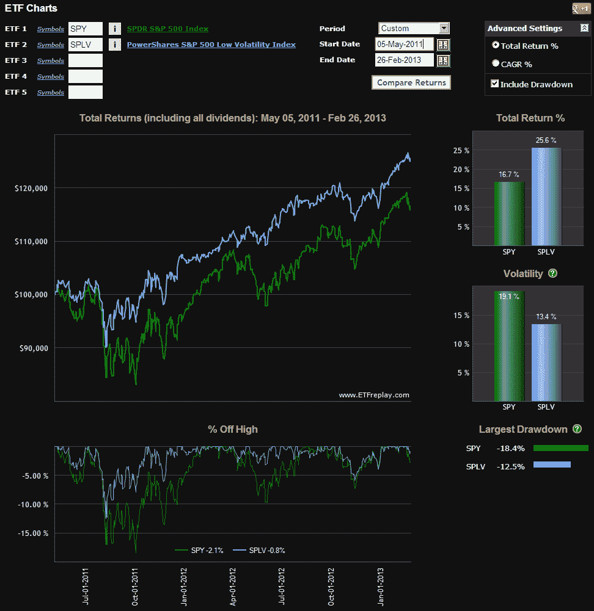

<!--yml

category: 未分类

date: 2024-05-18 16:18:02

-->

# VIX 和更多：超越 SPLV：低波动性 ETP 的扩展宇宙

> 来源：[`vixandmore.blogspot.com/2013/02/beyond-splv-expanding-universe-of-low.html#0001-01-01`](http://vixandmore.blogspot.com/2013/02/beyond-splv-expanding-universe-of-low.html#0001-01-01)

周一达到顶峰的波动性剧增似乎已经随着夏日的雷暴一样迅速消散。当然，正如我在六年前以上解释过的[狗狗能告诉我们关于波动性的什么](http://vixandmore.blogspot.com/2007/01/what-my-dog-can-tell-us-about_947.html)，风暴过后事情永远不会完全一样，这就是我们经常遇到的一个现象，我称之为[回声波动性](http://vixandmore.blogspot.com/search/label/echo%20volatility)。

大多数投资者——我知道自己是个例外——不喜欢波动性，并积极寻求降低投资组合波动性的策略。这种低波动性方法有很多优点，并且有相当多的学术研究支持低波动性投资的合理性。对于那些可能不感兴趣于通晓学术文献的人来说，下面的图表显示了自上市以来，SPLV 的表现明显优于 SPY，同时波动性也大幅降低。

自从交易所交易的革命开始以来，投资者就享有了各种低波动性的行业 ETP，比如公共事业（[XLU](http://vixandmore.blogspot.com/search/label/XLU)）和必需消费品（[XLP](http://vixandmore.blogspot.com/search/label/XLP)），以及一系列价值导向的 ETP（例如，[IWD](http://vixandmore.blogspot.com/search/label/IWD)和[VTV](http://vixandmore.blogspot.com/search/label/VTV)）和专注于分红的 ETP（例如，[VIG](http://vixandmore.blogspot.com/search/label/VIG)，[DVY](http://vixandmore.blogspot.com/search/label/DVY)和[SDY](http://vixandmore.blogspot.com/search/label/SDY))，但直到 2011 年 5 月，才有了专门针对低波动性持仓的交易所交易产品。于是，[PowerShares 标普 500 低波动性组合](http://www.invescopowershares.com/products/overview.aspx?ticker=SPLV)ETN（[SPLV](http://vixandmore.blogspot.com/search/label/SPLV)）应运而生，它立刻开始吸引投资者关注，目前管理着 34 亿美元的资产。SPLV 作为市场首个产品受益良多，但其成功也促使市场上出现了许多类似产品，其中最成功的可能是 iShares MSCI 美国最低波动性 ETF（[USMV](http://vixandmore.blogspot.com/search/label/USMV)）。自那时起，PowerShares 和 iShares 扩大了低波动性 ETP 产品线，覆盖了国际股票（[EFAV](http://vixandmore.blogspot.com/search/label/EFAV),[ACWV](http://vixandmore.blogspot.com/search/label/ACWV), [IDLV](http://vixandmore.blogspot.com/search/label/IDLV)）和新兴市场（[EEMV](http://vixandmore.blogspot.com/search/label/EEMV), [EELV](http://vixandmore.blogspot.com/search/label/EELV)）。

在低波动性竞赛的最新战场中，是美国市场市值的焦点，PowerShares 公司本月早些时候推出了 PowerShares S&P Mid Cap Low Volatility Portfolio ([XMLV](http://vixandmore.blogspot.com/search/label/XMLV)) ETN 和 PowerShares S&P Small Cap Low Volatility Portfolio ([XSLV](http://vixandmore.blogspot.com/search/label/XSLV)) ETN。我提到这两款新产品，因为这两者与 SPLV 之间的区别远超过市值上的差异。实际上，行业权重上的差异与市值上的差异一样显著。以 SPLV 作为基准，当前的行业权重为 31%的公共事业，24%的必需消费品和 15%的金融。相比之下，XMLV 的权重为 51%的金融，24%的公共事业，没有其他行业的权重超过 8%的组合。与 XSLV 相比，也没有太大差异，其权重为 50%的金融和 16%的公共事业。总之，这两款新产品不仅仅是 SPLV 的小市值版本，而是具有强烈金融成分的组合，对必需消费品的暴露非常小，并且对信息技术和工业等行业的暴露更多，所以 SPLV 与 XMLV 或 XSLV 之间的重复性比人们预期的要小。

积极和保守的投资者都应该努力使他们的投资组合中有一部分致力于低波动性工具。虽然传统的行业、价值和股息方法仍然有一定的道理，但不断增加的针对性低波动性产品的菜单确实也值得好好审视——最好是下一次大波动性风暴来临之前。

 *[来源：ETFreplay.com]*

相关文章：

**披露：** *无*
