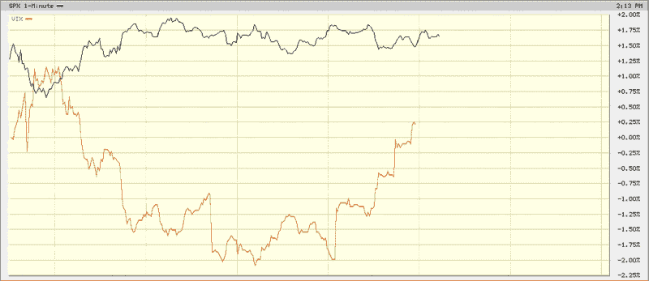

<!--yml

类别：未分类

日期：2024-05-18 17:46:18

-->

# VIX 和更多：当 SPX 原地踏步时 VIX 的大幅日内飙升

> 来源：[`vixandmore.blogspot.com/2009/05/big-intraday-surge-in-vix-while-spx.html#0001-01-01`](http://vixandmore.blogspot.com/2009/05/big-intraday-surge-in-vix-while-spx.html#0001-01-01)

尽管我倾向于避免过多谈论 VIX 的日内波动，但今天 VIX 的走势确实不同寻常。

- 首先，对于大多数周五，尤其是长周末之前，你应该预料到 VIX 会因为我在这里所说的[日历反转](http://vixandmore.blogspot.com/search/label/calendar%20reversion)而比平常低（略多于 1.0%），这是因为在几个非交易日之前，期权会以较低波动性进行重新定价。

当我打下这些字时，VIX 几乎持平，而所有主要指数都处于上涨状态。

然而，特别有趣的是，自东部时间下午 1 点以来，VIX 是如何飙升的。在下面的一个分钟内日线图表中，请注意 VIX 在过去一个小时左右是如何稳步上升的，而 SPX 基本上是横向移动的。

在 VIX 上的这种行动可能预示着最后几个小时会有些动荡，或者可能表明交易员们越来越担心在假期周末持有多头头寸。关注 VIX——以及房地产([IYR](http://vixandmore.blogspot.com/search/label/IYR))和金融([XLF](http://vixandmore.blogspot.com/search/label/XLF))的疲软。

*[source: BigCharts]*

***披露***：在撰写本文时，我持有 XLF、IYR 的空头头寸和 VIX 的多头头寸。
