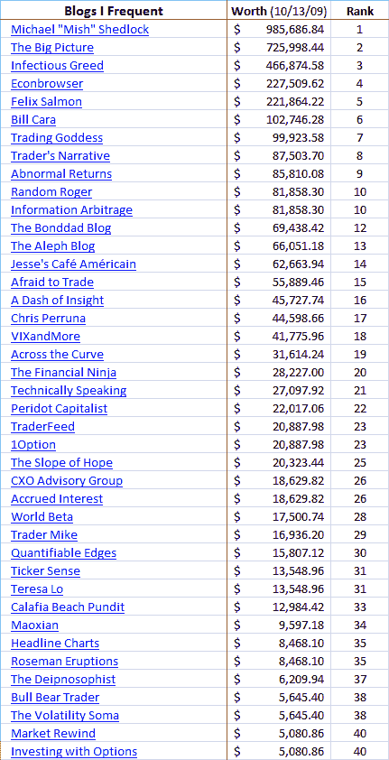

<!--yml

category: 未分类

date: 2024-05-18 17:26:26

-->

# VIX and More：博客网络比商业周刊更值得买吗？

> 来源：[`vixandmore.blogspot.com/2009/10/blogging-network-better-buy-than.html#0001-01-01`](http://vixandmore.blogspot.com/2009/10/blogging-network-better-buy-than.html#0001-01-01)

我认为自己是一个交易者，最初只是为了在交易日的低潮期创造一种刺激的消遣而涉足博客。在博客近三年后，现在有了 [新闻简报](http://vixandmoresubscriber.blogspot.com/) 和一本书（是的，它仍然在进行中），所以现在似乎我也成了电子媒体的实际成员。

我博客上出现的所有内容中，我很少谈论，但我非常自豪的一点是，我在右侧列中维护的“我常访的博客”列表。在我订阅的大约 300 个订阅源中，这是我认为绝对必读的 80 个博客。这个折衷的群体涵盖了广泛的问题和个人偏见。其中任何一个都可能引导读者走上一些崎岖的知识之路或偶尔的死胡同，但作为一个整体，这些声音始终是我刺激新信息和想法的最佳来源。

当我读到彭博以 [价值在 200 万至 500 万美元范围内](http://www.businessweek.com/innovate/FineOnMedia/archives/2009/10/bloomberg_wins.html) 收购了商业周刊时，我就在想着这一切。毫无疑问，我的博客列表的总价值至少要达到商业周刊的价值。

纯属娱乐——毕竟这只是一种刺激的消遣——我去了 [你的博客价值多少？](http://www.business-opportunities.biz/projects/how-much-is-your-blog-worth/) 功能，在 [商机博客](http://www.business-opportunities.biz/about/) 上看了一下对我博客列表价值的看法。根据 Technorati 链接数据的估值方法，商机博客能够计算出我博客列表中的 80 个博客中的 49 个的价值。这 49 个博客的总价值为 390 万美元，由于我无法获得像 [Bespoke Investment Group](http://bespokeinvest.typepad.com/bespoke/)、[Zero Hedge,](http://www.zerohedge.com/) [Calculated Risk](http://www.calculatedriskblog.com/) 和 [The Kirk Report](http://www.thekirkreport.com/) 这样的传媒重量级博客的价值，我毫不怀疑，我的博客列表的价值至少在 BusinessWeek 范围内最高端的 500 万美元以上。

为了纪念 [Casey Kasem](http://en.wikipedia.org/wiki/Casey_Kasem)，我在下面重现了 *VIX and More* 最有价值博客的前 40 名列表。

请继续阅读 BusinessWeek，但显然在这里还有更多价值。

彭博，你有我的电子邮件地址。

*[来源：商业机会博客]*
