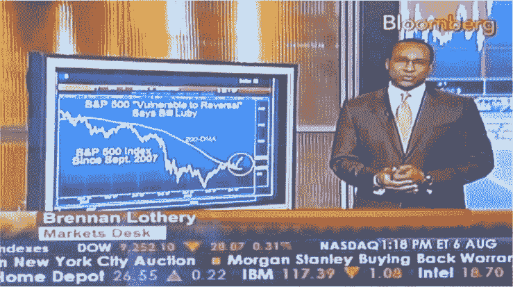

<!--yml

分类：未分类

日期：2024-05-18 17:34:58

-->

# VIX 和更多：彭博电视，TiVo 和 SPX

> 来源：[`vixandmore.blogspot.com/2009/08/bloomberg-tv-tivo-and-spx.html#0001-01-01`](http://vixandmore.blogspot.com/2009/08/bloomberg-tv-tivo-and-spx.html#0001-01-01)

 今天我经历了一系列有趣的事件。我不确定它们意味着什么，但我想把它们传给后世，以及遥远的可能性，也许对后来的人有所帮助。

虽然我绝对不是聊天室的人，但在今天交易的激烈无聊中，我决定加入[市场回放聊天室](http://chatroll.com/market-rewind/embed)，该聊天室由[市场回放](http://marketrewind.blogspot.com/)的杰夫·皮特施每天主持。

我在聊天室里不超过两分钟，就有人突然说我在“彭博社”。我以为他是在[彭博社.com](http://www.bloomberg.com/)的一篇文章中提到我，但结果他是指[彭博电视](http://www.bloomberg.com/media/tv/)。现在我知道我整个上午都没有离开过房子，甚至没有接过电话，这让我非常好奇。当我无法在彭博电视网站上找到任何东西时，我想到前一天晚上我可能在睡前打开了彭博亚洲。虽然我不了解 TiVo 的所有细微差别，但我知道即使你关掉电视，你观看的最后半小时左右的节目都会存储在缓冲区里。也许我妻子今天没有打开电视换台…

于是我飞奔楼上，果然发现布伦南·洛瑟里提到了*VIX 和更多*以及[通讯](http://vixandmoresubscriber.blogspot.com/)在一段关于股票可能出现调整的简短节目中。具体来说，洛瑟里抓住了周一帖子[SPX 15%超过 10 年来的 200 天移动平均线](http://vixandmore.blogspot.com/2009/08/spx-15-over-200-day-moving-average-for.html)的主题，并使用了一张最近 SPX 和[200 天简单移动平均线](http://vixandmore.blogspot.com/search/label/200%20day%20SMA)的图表，突出了两者之间的差距。

据我所知，这是第一次在任何主要金融电视台上引用*VIX 和更多*分析。

亚当在[每日期权报告](http://www.dailyoptionsreport.com/)中指出，彭博社段的多个归属和非常积极的语气与 CNBC 对博客者的几乎喜剧性的对抗态度形成了鲜明对比。

虽然我很高兴得到认可，但我发现如果没有以下这些不太可能的事件发生，我永远也不会发现这个：

1.  我决定 probably 第二次在我的生活中进入一个股票聊天室

1.  碰巧的是，我在 900 多个 DirecTV 频道中最后看的是彭博电视台。

1.  我妻子整个上午都很忙，无法换电视频道。

最后，我得出结论，确实有可能在今天这个电子捕鱼时代捕捉到意外之喜，尤其是如果你有 TiVo，并且能够猜出哪个频道可能会找到你在寻找的东西。
