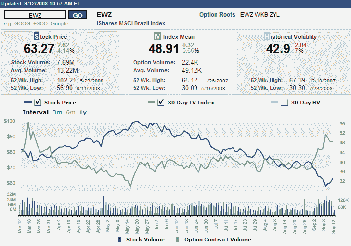

<!--yml

分类：未分类

日期：2024-05-18 18:27:04

-->

# VIX 和更多：巴西找到底部了吗？

> 来源：[`vixandmore.blogspot.com/2008/09/brazil-finding-bottom.html#0001-01-01`](http://vixandmore.blogspot.com/2008/09/brazil-finding-bottom.html#0001-01-01)

如我昨日所述，在[美国 VIX 与 BRIC VIX 的对比](http://vixandmore.blogspot.com/2008/09/us-vix-vs-bric-vix.html)中，[新兴市场](http://vixandmore.blogspot.com/search/label/emerging%20markets)在过去几个月中一直在苦苦挣扎。

一个能说明新兴市场脆弱性的优秀例子可以在[巴西](http://vixandmore.blogspot.com/search/label/Brazil)找到，巴西国家 ETF（[EWZ](http://vixandmore.blogspot.com/search/label/EWZ)）从 5 月底的高点跌至昨日低点，跌幅达到了 44.3%。现在抓底部是一个最适合那些过于自信、缺乏常识的人的游戏，但有几个因素让我相信昨日的低点可能是一个中期或长期底部。

从纯粹的技术角度来看，下图显示了周二为最低收盘价（昨日盘中 52 周新低被省略）。周二，EWZ 的期权交易量达到了 2008 年的新高，隐含波动率激增至 3 月份恐慌以来未见的水平。当然，这些因素并不能保证一个底部，但综合考虑，并且鉴于 EWZ 在今天再次表现出相对强势（在我打这些字时上涨了超过 4%），它们增加了盈利进入的可能性。

【来源：国际证券交易所】

【披露：撰写本文时持有 EWZ】
