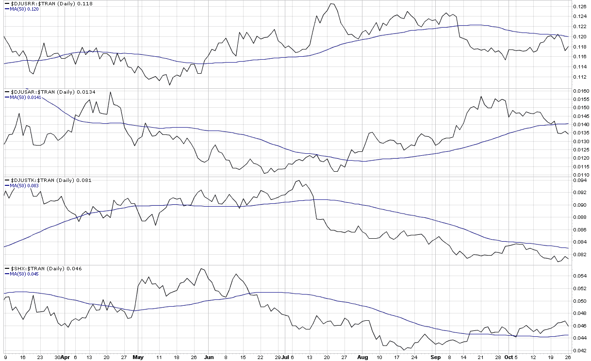

<!--yml

类别：未分类

日期：2024-05-18 17:25:08

-->

# VIX 和更多：分解运输行业的弱点

> 来源：[`vixandmore.blogspot.com/2009/10/breaking-down-weakness-in-transports.html#0001-01-01`](http://vixandmore.blogspot.com/2009/10/breaking-down-weakness-in-transports.html#0001-01-01)

昨天的[图表一周：下跌的运输行业](http://vixandmore.blogspot.com/2009/10/chart-of-week-falling-transports.html)审视了近期[道琼斯运输平均指数](http://en.wikipedia.org/wiki/Dow_Jones_Transportation_Average) ([DJTA](http://vixandmore.blogspot.com/search/label/DJTA))的弱点，并包括了对该指数相对于标普 500 指数表现的研究。

今天我将深入研究 DJTA 的内部构造，并突出四个通常被忽视的交通子行业指数：

+   Dow Jones US Railroad Index [($DJUSRR](http://stockcharts.com/charts/gallery.html?%24djustr))

+   Dow Jones US Airlines Index [($DJUSAR](http://stockcharts.com/charts/gallery.html?%24djusar))

+   Dow Jones US Trucking Index [($DJUSTR](http://stockcharts.com/charts/gallery.html?%24djusar))

+   PHLX 海洋运输指数([$SHX](http://stockcharts.com/charts/gallery.html?%24shx))

下面的图表，将上述子行业指数作为 DJTA 的百分比显示，在过去的一个月里，航空公司相对于更广泛的运输平均值一直是最落后的，而铁路和卡车运输业也未能跟上 DJTA 的速度。运输行业的相对强度来自于海洋运输商——这一点得到了[波罗的海干散货指数](http://vixandmore.blogspot.com/search/label/Baltic%20Dry%20Index)（图表中未显示）最近的强劲表现的支持。

虽然我还没有看到铁路和卡车运输行业的 ETF，但有两个可用的 ETF 是流行的 Claymore/Delta 全球运输 ETF ([SEA](http://vixandmore.blogspot.com/search/label/SEA)) 和不太活跃的 Claymore/NYSE Arca 航空 ETF ([FAA](http://vixandmore.blogspot.com/search/label/FAA))。

为了获取关于运输行业及其子行业指数的更多文章，读者们可以查看：

来源：[StockCharts]
