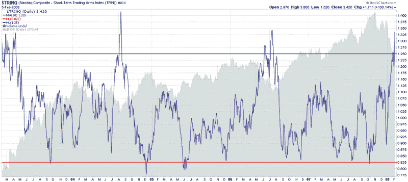

<!--yml

分类：未分类

date: 2024-05-18 18:44:44

-->

# VIX and More: Bullish NASDAQ TRIN Signal

> 来源：[`vixandmore.blogspot.com/2008/02/bullish-nasdaq-trin-signal.html#0001-01-01`](http://vixandmore.blogspot.com/2008/02/bullish-nasdaq-trin-signal.html#0001-01-01)

我最喜欢的逆向情绪指标之一是(纽约证券交易所)

[TRIN](http://vixandmore.blogspot.com/search/label/TRIN)

and it’s

[纳斯达克对应指标](http://vixandmore.blogspot.com/search/label/TRINQ)

, which StockCharts.com (responsible for the chart below) codes as the

[$TRINQ](http://vixandmore.blogspot.com/search/label/TRINQ)

.

我今天选择的海报 [编辑：更新后的 EOD 图表在下面第一张；第二张图表提供了更长的历史背景] 使用过去两个月内的 60 分钟柱状图来表明，尽管最近有所反弹，但今天的行动 setup another bullish contrarian buy signal – at least in the NDX。如果考虑到 1780 点附近可能存在一些支撑，这个信号看起来会更加强烈。对此持保留态度，但考虑到 TRINQ 近期表现非常强劲。

也要考虑到，在当前的不确定性环境中，任何强烈波动的出现都可能值得谨慎对待 – 或许在重要的支撑和阻力水平之外卖出期权。

   *[来源：StockCharts.com]*
