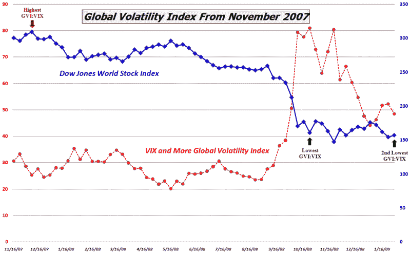

<!--yml

分类：未分类

日期：2024-05-18 18:02:17

→

# VIX and More: 全球波动指数的看涨信号

> 来源：[`vixandmore.blogspot.com/2009/02/bullish-signal-from-global-volatility.html#0001-01-01`](http://vixandmore.blogspot.com/2009/02/bullish-signal-from-global-volatility.html#0001-01-01)

**VIX and More** 的专有[全球波动指数](http://vixandmore.blogspot.com/search/label/Global%20Volatility%20Index)自我在 2008 年 11 月[推出](http://vixandmore.blogspot.com/2008/11/introducing-vix-and-more-global.html)以来一直很受欢迎，这意味着我将定期更新它，并在未来标记这个领域的有趣发展。

周五收盘时，全球波动指数与 VIX 之间的差异缩小到了自 10 月以来的最低水平，溢价百分比（GVI 除以 VIX）达到了有史以来的第二低水平。我认为这是一个看涨信号。

在下面的图表中，我用红色和绿色箭头标记了溢价百分比的先前高点和低点。红色箭头标记的高点来自 2007 年 12 月的第一周，是一个很好的卖空机会。来自 10 月底的绿色箭头是一个早期的底部。在此之后的几个月里，[道琼斯世界股票指数](http://vixandmore.blogspot.com/search/label/Dow%20Jones%20World%20Stock%20Index)基本上停滞不前。虽然这个指标相对较新且未经测试，但我认为周五的第二低读数加强了或确认了 10 月的买入信号。

一如既往，买家需谨慎。

**来源：VIX and More**
