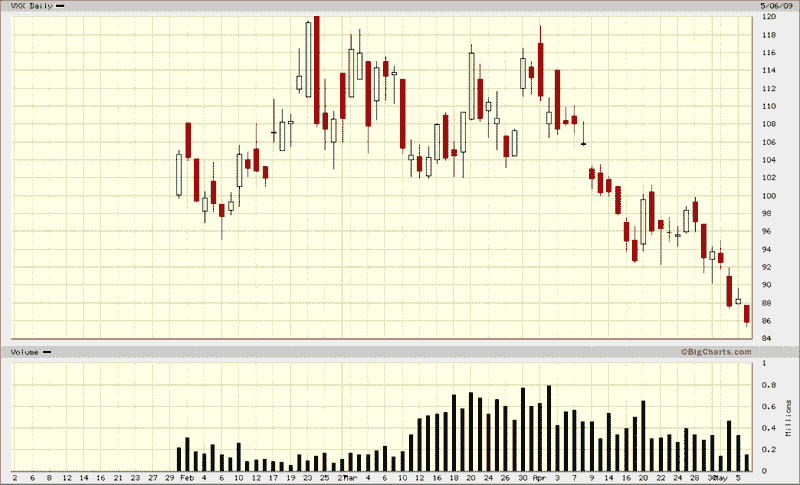

<!--yml

类别：未分类

日期：2024-05-18 17:48:40

-->

# VIX and More: 对 VXX 持乐观态度

> 来源：[`vixandmore.blogspot.com/2009/05/bullish-on-vxx.html#0001-01-01`](http://vixandmore.blogspot.com/2009/05/bullish-on-vxx.html#0001-01-01)

所有预先宣布的消息已经消除了银行压力测试结果公布的大部分不确定性，毫不奇怪，波动率已经崩溃。随着 VIX 达到 32.53，VXX 最后交易价为 85.19，这似乎是买入[VXX](http://vixandmore.blogspot.com/search/label/VXX)和/或[VIX 期权](http://vixandmore.blogspot.com/search/label/VIX%20options)的好时机。

来源：[BigCharts](http://www.bigcharts.com)

***披露***：撰写本文时，作者持有 VIX 和 VXX。*
