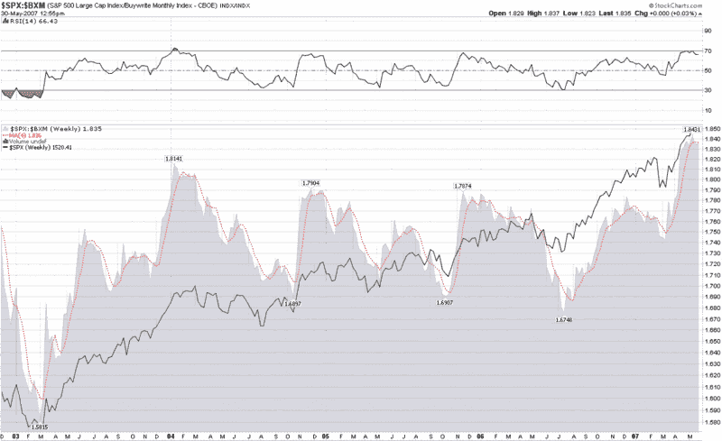

<!--yml

分类：未分类

日期：2024-05-18 19:12:49

-->

# VIX 和更多：买入写指数作为时机工具？

> 来源：[`vixandmore.blogspot.com/2007/05/buywrite-index-as-timing-tool.html#0001-01-01`](http://vixandmore.blogspot.com/2007/05/buywrite-index-as-timing-tool.html#0001-01-01)

Adam 在 Daily Options Report([每日期权报告](http://adamsoptions.blogspot.com/)最近一直在详细谈论[CBOE S&P 500 买入写指数(BXM)](http://www.cboe.com/micro/bxm/introduction.aspx)和相关产品——足够让我自己也开始关注。在上面链接的 CBOE 网站上，Adam 的评论以及 ETF 友好博客作者['Random' Roger Nusbaum](http://randomroger.blogspot.com/search?q=bxm)的见解，你可以了解到关于 BXM 和利用覆盖式看涨期权策略的产品几乎所有你想知道的东西。嗯，几乎所有。

我开始思考 BXM 是否可能作为时机工具有用。在 StockCharts.com 花了一些时间后，我整理了几张比较 SPX 和 BXM 的比率图表。在下面的周比率图表中，我注意到在过去几年中，当 SPX 对 BXM 比率接近 1.80（或通常作出任何 6-12 个月的的高点）并反转时，这通常为 SPX 在接下来两到三个月内的重大调整提供了一些提前警告。当前图表中特别引起我注意的是非常高的 1.836 移动平均读数，这看起来刚刚开始反转。

这个比率是值得关注的东西；BXM 和相关产品（BEP、MCN 以及新发行的 ETN，BWV）是另一种思考在可能变成顶端市场的市场中收获波动性的方法。

