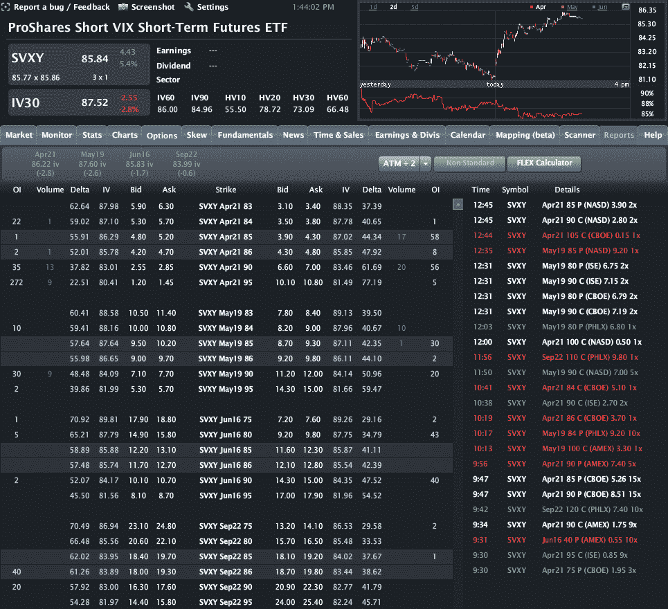

<!--yml

分类：未分类

date: 2024-05-18 16:33:03

-->

# VIX and More: Buying SVXY Calls when the VIX Spikes

> 来源：[`vixandmore.blogspot.com/2012/04/buying-svxy-calls-when-vix-spikes.html#0001-01-01`](http://vixandmore.blogspot.com/2012/04/buying-svxy-calls-when-vix-spikes.html#0001-01-01)

根据我本周收到的几封电子邮件，看来有很多读者在关注购买一些反向[VIX ETP](http://vixandmore.blogspot.com/search/label/VIX%20ETN)，特别是[XIV](http://vixandmore.blogspot.com/search/label/XIV)和[SVXY](http://vixandmore.blogspot.com/search/label/SVXY)，当看到 VIX 跳升时。有些人更喜欢做空[VXX](http://vixandmore.blogspot.com/search/label/VXX)，[TVIX](http://vixandmore.blogspot.com/search/label/TVIX)和[UVXY](http://vixandmore.blogspot.com/search/label/UVXY)，部分原因是可用性，而其他人则更喜欢交易 VXX 期权，通常是通过购买看跌期权或使用看跌看涨期权等限制风险的方法。

我本以为我最近的[UVXY 和 SVXY 期权开启了新的 VIX ETP 交易方法](http://vixandmore.blogspot.com/2012/03/options-on-uvxy-and-svxy-open-up-new.html)可能会促使一些交易者考虑涉及+2x 杠杆的短期 VIX ETF（UVXY）的交易策略，也许还会利用-1x 短期 VIX ETF（SVXY），但根据成交量来看，这些问题仍在吸引更广泛的受众。事实上，周二 UVXY 确实创下了 7300 份合约的记录看涨期权成交量，但 SVXY 迄今为止一直是落后者，如下图所示。

所以这里有一个想法：下次 VIX 出现显著跳升时，你应该首先调查的交易之一就是通过购买 SVXY 的虚值看涨期权来对冲这种跳升。这是一个简单的交易，有可能带来相当可观的利润。例如，SVXY 的 4 月 90 美元看涨期权，自周二收盘以来已经上涨了 40%。

关于 SVXY 和 UVXY 期权的激动人心的消息是，交易者现在可以轻松构建涉及明确[风险](http://vixandmore.blogspot.com/search/label/risk)和巨大上升空间的多种交易策略。虽然 VXX（和 VIX）期权仍然是流动性的黄金标准，但 SVXY 和 UVXY 期权也值得一些关注——即使它们的价差仍然比 VXX 宽。

Related posts:

***披露：*** 在撰写本文时，持有多头 XIV 和 SVXY，空头 VXX、TVIX 和 UVXY；Livevol 是 VIX 和 More 的广告商。
