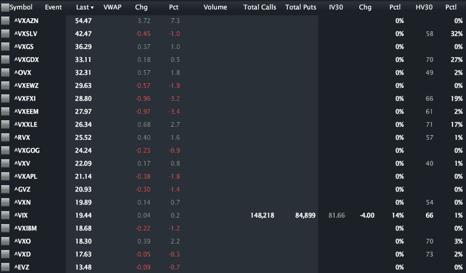

<!--yml

category: 未分类

date: 2024-05-18 16:41:54

-->

# VIX and More: CBOE Adds Options to Emerging Markets Volatility Index (VXEEM)

> 来源：[`vixandmore.blogspot.com/2012/01/cboe-adds-options-to-emerging-markets.html#0001-01-01`](http://vixandmore.blogspot.com/2012/01/cboe-adds-options-to-emerging-markets.html#0001-01-01)

本月早些时候，CBOE[推出了](http://vixandmore.blogspot.com/2011/12/cboe-to-launch-futures-on-emerging.html)基于 CBOE 新兴市场 ETF 波动指数([VXEEM](http://vixandmore.blogspot.com/search/label/VXEEM))的期货，仅仅三周后，VXEEM 期权开始交易。

关于 VXEEM 期权的更多信息，这种期权是基于流行[EEM](http://vixandmore.blogspot.com/search/label/EEM)新兴市场 ETF 的，首先可以参考 CBOE 的 VXEEM[期权产品规格页面](http://www.cboe.com/products/IndexOpts/VXEEM_spec.aspx)。特别值得注意的是，VXEEM 期权的到期周期与期货产品相同。此外，VXEEM 期货和期权的到期周期与 VIX 期货和期权相同，这意味着它们将在星期三到期（2 月 15 日，3 月 21 日，4 月 18 日和 5 月 16 日），期权最后交易时间为到期前一周的星期二。更多信息，请查看 CBOE 的 VXEEM[主页](http://www.cboe.com/micro/VIXETF/VXEEM/)和[信息公告](http://www.cfe.cboe.com/publish/CFEinfocirc/CFEIC11-079.pdf)。

下图来自 LivevolPro.com，我收集了一些主要美国波动指数的收盘数据，包括那些为 ETPs 和单一股票的波动指数。这些指数从高到低排序，为市场对各种股票、股票群体（部门和地理区域）和资产类别的相对风险感知提供了很好的感觉。

部分由于今天的收益公告，[VXAZN](http://vixandmore.blogspot.com/search/label/VXAZN)，亚马逊([AMZN](http://vixandmore.blogspot.com/search/label/AMZN))的波动指数居于首位，银的波动指数([VXSLV](http://vixandmore.blogspot.com/search/label/VXSLV))、高盛([VXGS](http://vixandmore.blogspot.com/search/label/VXGS))和黄金矿工([VXGDX](http://vixandmore.blogspot.com/search/label/VXGDX))的波动指数位列前四。VXEEM 在二十个波动指数中排名第八，为 27.97，目前 VXEEM 相对于 VIX 的溢价为 43.8%。这个 43.8%的溢价是否过高？过低？现在有了 VXEEM 期权（和期货），你不仅可以表达你的观点，而且如果你正确的话还可以获得经济利益。

相关文章：

**

*[来源(s): LivevolPro.com]*

***披露(s):*** Livevol 是 VIX and More 的广告商*
