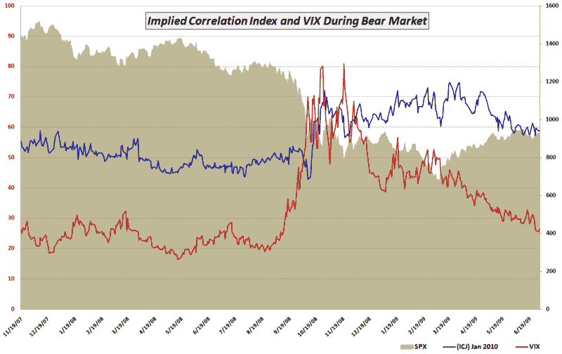

<!--yml

分类：未分类

日期：2024-05-18 17:37:15

-->

# 《VIX 和更多》：CBOE 推出隐含相关性指数

> 来源：[`vixandmore.blogspot.com/2009/07/cboe-launches-implied-correlation-index.html#0001-01-01`](http://vixandmore.blogspot.com/2009/07/cboe-launches-implied-correlation-index.html#0001-01-01)

从下周一开始，波动率观察者和风险管理者将有一个新的指数可以关注：[CBOE 标普 500 隐含相关性指数](http://vixandmore.blogspot.com/search/label/Implied%20Correlation%20Index)。CBOE 在昨天的[新闻稿](http://cboe.com/AboutCBOE/ShowDocument.aspx?DIR=ACNews&FILE=cboe_20090722.doc&CreateDate=22.07.2009)中宣布了这一新指数，并指出隐含相关性指数将与两种不同的期权到期挂钩 - 2010 年 1 月（[ICJ](http://vixandmore.blogspot.com/search/label/ICJ)）和 2011 年 1 月（[JCJ](http://vixandmore.blogspot.com/search/label/JCJ)）。ICJ 和 JCJ 的值将由 CBOE 在交易日内每 15 秒发布一次，就像 VIX 一样。

隐含相关性指数并不计算整个标普 500 指数之间的相关性。相反，它利用了以市值测量的 SPX 前 50 大成分股的“跟踪组合”。关于隐含相关性指数及其相关材料的计算细节，请访问[隐含相关性指数主页](http://www.cboe.com/micro/impliedcorrelation/default.aspx)，[隐含相关性指数白皮书](http://www.cboe.com/micro/impliedcorrelation/ImpliedCorrelationIndicator.pdf)以及从 2007 年初开始的[历史数据](http://www.cboe.com/publish/impliedcorrelation/implied_correlation_hist.xls)。

我将在博客上讨论这个指数，因为它显然是 VIX 估值谜团中的一个重要组成部分。现在，读者可能感兴趣的是，在最近的市场低迷期间，SPX 成分股相关性（蓝线）与 VIX（红线）相比如何。

[来源：CBOE](http://www.cboe.com/)
