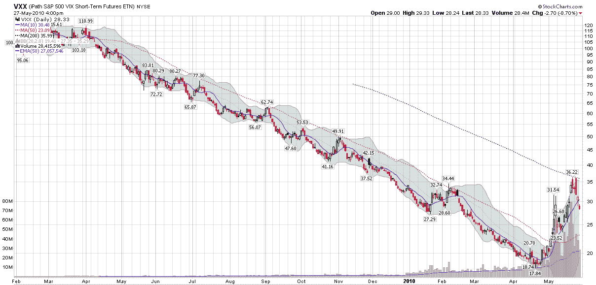

<!--yml

分类：未分类

日期：2024-05-18 17:09:31

-->

# VIX and More: CBOE Launches Options on VXX and VXZ

> 来源：[`vixandmore.blogspot.com/2010/05/cboe-launches-options-on-vxx-and-vxz.html#0001-01-01`](http://vixandmore.blogspot.com/2010/05/cboe-launches-options-on-vxx-and-vxz.html#0001-01-01)

iPath S&P 500 VIX Short-Term Futures ETN ([VXX](http://vixandmore.blogspot.com/search/label/VXX))一直是*VIX and More*上最受关注的话题之一，自从 2009 年 1 月[VXX 和 VXZ 首次交易日](http://vixandmore.blogspot.com/2009/01/first-day-of-trading-in-vxx-and-vxz.html)以来。在接下来的 16 个月里，VXX 从一个小众产品变成了日交易者的最爱，过去 18 个交易日的成交量都超过了 2000 万股。因此，我感到非常兴奋的是，CBOE 今天开始提供 VXX 和 VXZ 的期权。(感谢[Adam Warner](http://dailyoptionsreport.com/blog/post/hey-you-can-trade-options-on-vxx-now/#When:13:45:03Z))

我已经在本平台详尽地讨论过 VXX 及其姊妹产品 iPath S&P 500 VIX Mid-Term Futures (5 month) ETN ([VXZ](http://vixandmore.blogspot.com/search/label/VXZ))的计算和性能怪癖，今天不再深入这个话题。对于那些有兴趣更深入探讨这些问题的人来说，下面的链接是一个很好的起点，标签和超链接也适用于诸如[VXX](http://vixandmore.blogspot.com/search/label/VXX)、[期限结构](http://vixandmore.blogspot.com/search/label/term%20structure)、[VIX 期货](http://vixandmore.blogspot.com/search/label/VIX%20futures)、[正向市场](http://vixandmore.blogspot.com/search/label/contango)和负[滚动收益率](http://vixandmore.blogspot.com/search/label/roll%20yield)。

关于 VXX 计算和性能的更深入讨论可以在[Expiring Monthly](http://www.expiringmonthly.com/)2010 年 3 月号的*The VIX ETNs: VXX and VXZ*中找到。

我认为可以安全地说[VXX 期权](http://vixandmore.blogspot.com/search/label/VXX%20options)将开启一个全新的波动性交易机会世界，无论单独考虑还是与[VIX 期权](http://vixandmore.blogspot.com/search/label/VIX%20options)和其他波动性产品结合考虑。我肯定会投入大量时间在这个主题上。

对于相关主题的更多信息，读者们可以查看：

*[来源：StockCharts.com]*

***披露(s):*** *在撰写本文时持有 VXX 的空头仓位；我是 Expiring Monthly 的创始人之一和所有者*
