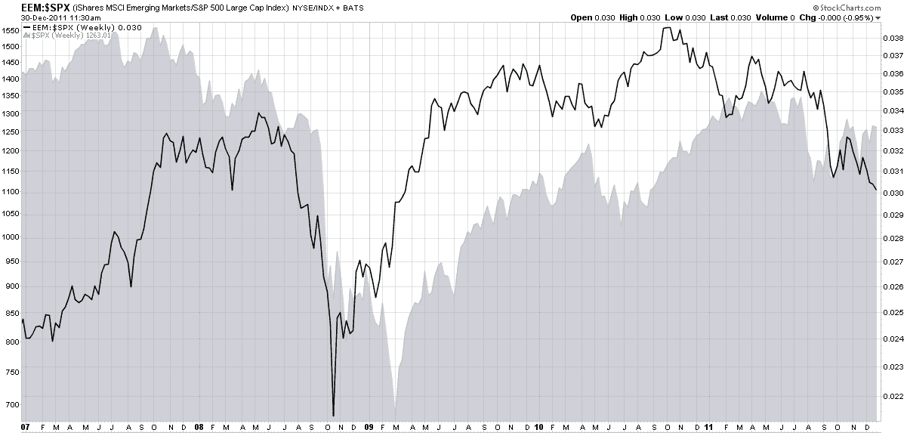

<!--yml

category: 未分类

date: 2024-05-18 16:44:36

-->

# VIX and More: CBOE To Launch Futures on Emerging Markets Volatility (VXEEM)

> 来源：[`vixandmore.blogspot.com/2011/12/cboe-to-launch-futures-on-emerging.html#0001-01-01`](http://vixandmore.blogspot.com/2011/12/cboe-to-launch-futures-on-emerging.html#0001-01-01)

One of the predictions I made for 2011 was that the trend toward what I have labeled “[atomic volatility](http://vixandmore.blogspot.com/search/label/atomic%20volatility)” (a lessening of the scope of the underlying for options contracts and/or the duration of those contracts) would accelerate.

Back in March 2011, the CBOE helped to usher in the atomic volatility era when they rolled out volatility indices using the VIX methodology for six sector and geography ETFs:

+   iShares MSCI Emerging Markets Index Fund ([VXEEM](http://vixandmore.blogspot.com/search/label/VXEEM))

+   iShares Trust FTSE China 25 Index Fund  ([VXFXI](http://vixandmore.blogspot.com/search/label/VXFXI))

+   iShares MSCI Brazil Index Fund  ([VXEWZ](http://vixandmore.blogspot.com/search/label/VXEWZ))

+   Market Vectors Gold Miners Fund ([VXGDX](http://vixandmore.blogspot.com/search/label/VXGDX))

+   iShares Silver Trust ([VXSLV](http://vixandmore.blogspot.com/search/label/VXSLV))

+   Energy Select Sector SPDR ([VXXLE](http://vixandmore.blogspot.com/search/label/VXXLE))

Later in March, the CBOE [rolled out](http://ir.cboe.com/releasedetail.cfm?ReleaseID=560015) futures based on the gold volatility index ([GVZ](http://vixandmore.blogspot.com/search/label/GVZ)), which was [launched](http://vixandmore.blogspot.com/search/label/GVZ) back in August 2008, at the same time as the euro volatility index ([EVZ](http://vixandmore.blogspot.com/search/label/EVZ)) and several weeks after the launch of the [OVX](http://vixandmore.blogspot.com/2008/07/cboe-launches-oil-vix-ovx.html), known affectionately as “the Oil VIX.” *[Those who are interested in the sequencing of the launch of various volatility measures should refer to [The Evolution of the Volatility Index Family Tree](http://vixandmore.blogspot.com/2008/08/evolution-of-volatility-index-family.html).]*

现在，CBOE 正在通过 VXEEM 这个基于流行的新兴市场 ETF（[EEM](http://vixandmore.blogspot.com/search/label/EEM)）的波动指数采取下一步行动，并为此指数提供期货。这些期货合约的推出定于 1 月 9 日，并将最初包括 2 月、3 月、4 月和 5 月到期的合约。请注意，这些合约的到期周期与 VIX 期货和期权相同，这意味着它们将在星期三到期（2 月 15 日、3 月 21 日、4 月 18 日和 5 月 16 日），并且可以在到期前的星期二最后交易。更多信息，请查看 CBOE 的 VXEEM[主页](http://www.cboe.com/micro/VIXETF/VXEEM/)和[信息公告](http://www.cfe.cboe.com/publish/CFEinfocirc/CFEIC11-079.pdf)。

我认为基于 EEM 和 VXEEM 的产品有可能成功的一个原因在于，新兴市场通常波动性很高——远比构成标普 500 指数的股票篮子要高得多，而 VIX 就是基于这个指数的。例如，目前 EEM 的 60 天历史波动率比 SPX 高出超过 50%。这意味着短期交易者可能会发现 VXEEM 产品（包括期货、期权和 ETP，假设它们已经在研发中）是适合他们某些喜爱策略的高性能交易工具，就像杠杆 ETP 和 VIX 基础产品一样。

此外，如下图所示，新兴市场有时会与美国股票呈现出不同的周期性走势。注意 EEM 与 SPX 的比率在过去五年中波动很大，并且与 SPX 的底部和顶部不同。这种现象是否会在未来持续（受到[中国](http://vixandmore.blogspot.com/search/label/China)的强烈影响）还有待观察，但 2012 年相对于发达市场，新兴市场的角色应该受到密切关注。

相关文章：

来源：[StockCharts.com]

**披露信息：** 无
