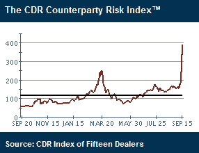

`<!--yml`

分类：未分类

日期：2024-05-18 18:26:39

`-->`

# VIX and More: CDR 对手方风险指数淹没三月高点

> 来源：[`vixandmore.blogspot.com/2008/09/cdr-counterparty-risk-index-swamps.html#0001-01-01`](http://vixandmore.blogspot.com/2008/09/cdr-counterparty-risk-index-swamps.html#0001-01-01)

[信用衍生品研究](http://www.creditresearch.com/)有一个对手方风险指数（以及一系列相关子指数），该指数计算了 15 家最大信用衍生品交易商的平均信用利差。在信贷市场最近的动荡之后，该指数现在比 2008 年 3 月的高点高出超过 50%。

不足为奇的是，[Markit](http://vixandmore.blogspot.com/search/label/Markit) CDX([信用违约互换](http://vixandmore.blogspot.com/search/label/credit%20default%20swaps))指数也出现了类似的波动。

`[图表由信用衍生品研究提供]`
