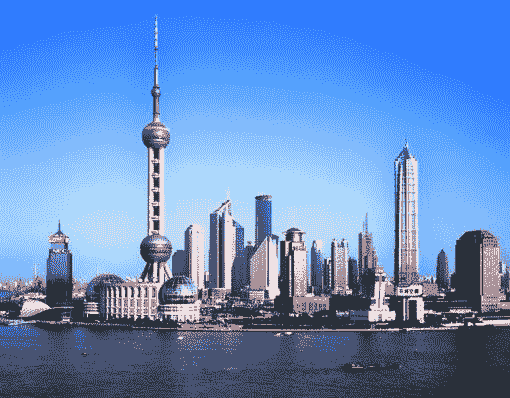

<!--yml

category: 未分类

date: 2024-05-18 19:13:40

-->

# VIX and More: CNBC Loser’s Bracket:: #1056 (Top 1%)

> 来源：[`vixandmore.blogspot.com/2007/05/cnbc-losers-bracket-1056-top-1.html#0001-01-01`](http://vixandmore.blogspot.com/2007/05/cnbc-losers-bracket-1056-top-1.html#0001-01-01)

对于那些可能感兴趣的人来说，[CNBC 百万美元投资组合挑战赛](http://www.cnbc.com/id/17506588/)本周将进入尾声，20 名顶尖表现者将为 100 万美元的奖金展开争夺，这笔奖金将分多年通过 IV 滴支付，而[第二次机会对决](http://www.cnbc.com/id/18819614)的参赛者将在输家组中再次争取荣誉——获胜者将获得一台[索尼](http://finance.google.com/finance?q=sne&hl=en)家庭娱乐系统作为安慰奖。

我从未有机会 properly [记录](http://vixandmore.blogspot.com/search/label/CNBC%20Million%20Dollar%20Portfolio%20Challenge)我在第一轮比赛中起伏的真实程度，因为 CNBC 在我做适当的死后解剖之前抹去了细节。我所知道的是，在达到[前 0.08%](http://vixandmore.blogspot.com/2007/04/cnbc-million-dollar-portfolio-challenge_30.html)后，我跌到了大约[前 11%](http://vixandmore.blogspot.com/2007/05/cnbc-million-dollar-portfolio-challenge_07.html)，最后的成绩大约是 200,000 名，甚至可能更低。

好消息是，这个比赛给了我一个机会来测试一些关于如何找到即将发生重大变动的股票的想法。由于比赛结束时正值财报季，我专注于那些接下来 24 小时内将公布财报的公司，并在 5 月 9 日的[如何找到财报前的涨幅股](http://vixandmore.blogspot.com/2007/05/how-to-find-earnings-spiker-before.html)一文中公布了我的公式和一些相关免费公共信息来源。最近，我回顾了根据那个财报涨幅公式投资的公司，发现这些公司第二天最小的变动是 1.5%，最大变动是 30.2%（这次是下跌），平均变动是 5.6%，中位数变动是 3.7%——所有这些都是基于一天的持有期。

有了这些信息，我想我应该在输家组中再次使用同样的公式。再次取得成功，我最后四只股票的收益分别是[PETM](http://finance.google.com/finance?q=petm&hl=en)上涨 3.0%，[FMCN](http://finance.google.com/finance?q=fmcn&hl=en)上涨 7.7%，[TSL](http://finance.google.com/finance?q=tsl&hl=en)上涨 5.3%，[SNDA](http://finance.google.com/finance?q=snda&hl=en)上涨 3.0%。底线是，这个表现让我在当前比赛中位列前 1%的第 1056 名。

然而，在我开始自吹自擂之前，看起来我可能给自己挖了一个坑。上海 based 的盛大娱乐原本是一个稳健的收益选择，并且交出了一个[非常强劲的季度](http://biz.yahoo.com/ap/070523/shanda_interactive_ahead_of_the_bell.html?.v=3)的成绩单，但我似乎被我自己的[迷失在翻译](http://www.imdb.com/title/tt0335266/)时刻挫败了，并且在收益前意外地卖出。更糟糕的是，我从盛大的岩石上跳到了[游戏 Stop (GME)](http://finance.google.com/finance?q=gme&hl=en)，其收入翻倍的好消息被[不温不火的指引](http://www.thestreet.com/_yahoo/newsanalysis/techgames/10358502.html?cm_ven=YAHOO&cm_cat=FREE&cm_ite=NA)所抵消。我再次得到了我的波动性，但 GME 目前交易下跌了 3.6%。
