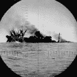

<!--yml

category: 未分类

date: 2024-05-18 15:45:44

-->

# VIX and More: CNBC Million Dollar Portfolio Challenge: #107,526

> 来源：[`vixandmore.blogspot.com/2007/05/cnbc-million-dollar-portfolio-challenge_04.html#0001-01-01`](http://vixandmore.blogspot.com/2007/05/cnbc-million-dollar-portfolio-challenge_04.html#0001-01-01)

好吧，这个图表可能有点过于夸张，但本周初我排名第 1047，现在看来我剩下的唯一事情就是与[收益激增潜力算法](http://vixandmore.blogspot.com/search/label/earnings%20spike%20potential%20algorithm)一起更多地去享受。

在这个疯狂的竞赛中有[1,598,913 名参赛者](http://www.cnbc.com/id/18487672)，我仍然可以声称自己处于前 7%，但按照我投资组合目前下沉的速度，我的最终目标可能是努力回到前 100,000 名。

昨天在[OTEX](http://finance.google.com/finance?q=otex&hl=en)上的行程最终造成了 3.8%的损失。今天，我改变了一下，听从了算法的建议，跳上了[LeapFrog Enterprises (LF)](http://finance.google.com/finance?q=lf&hl=en)。到目前为止，这是本周我最好的选择……(等一下)……今天仅仅下跌了 1.6%。

周末总是短暂，人们有机会对一个并购目标（也许[Options Doggy](http://optionsdoggy.typepad.com/options_doggy/)能嗅出一个）进行投机，关注一些[Dendreon (DNDN)](http://finance.google.com/finance?q=dndn&hl=en)的新闻，或者走我标准的收益路线。收益选择不多，但算法生成了周一的前四项选择如下：

1.  [Flamel Technologies (FLML)](http://finance.google.com/finance?q=flml&hl=en)

1.  [Delta Petroleum (DPTR)](http://finance.google.com/finance?q=dptr&hl=en)

1.  [Cogent Communications Group (CCOI)](http://finance.google.com/finance?q=ccoi&hl=en)

1.  [Kinross Gold (KGC)](http://finance.google.com/finance?q=kgc&hl=en)

记录在案，我认为 Delta 是一个有趣的勘探和生产选择，对于喜欢全垒打的人来说是一个很好的选择。我在真实资金组合中拥有它超过一年，也围绕它进行了很多交易。不管怎样，我从去年 10 月开始拥有并交易 Flamel，仍然喜欢这个生物科技/药物递送选择的前景。再次，我将遵循算法的建议，周一选择 FLML。

下周是 CNBC 比赛的最后一周，我打算以强劲的势头结束。
